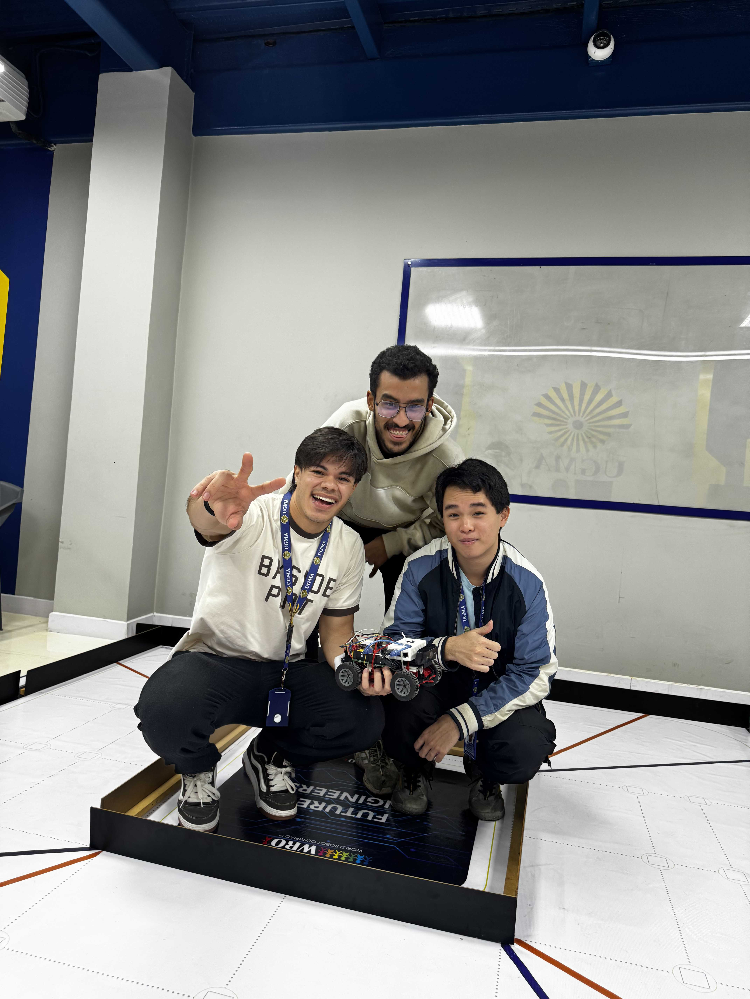
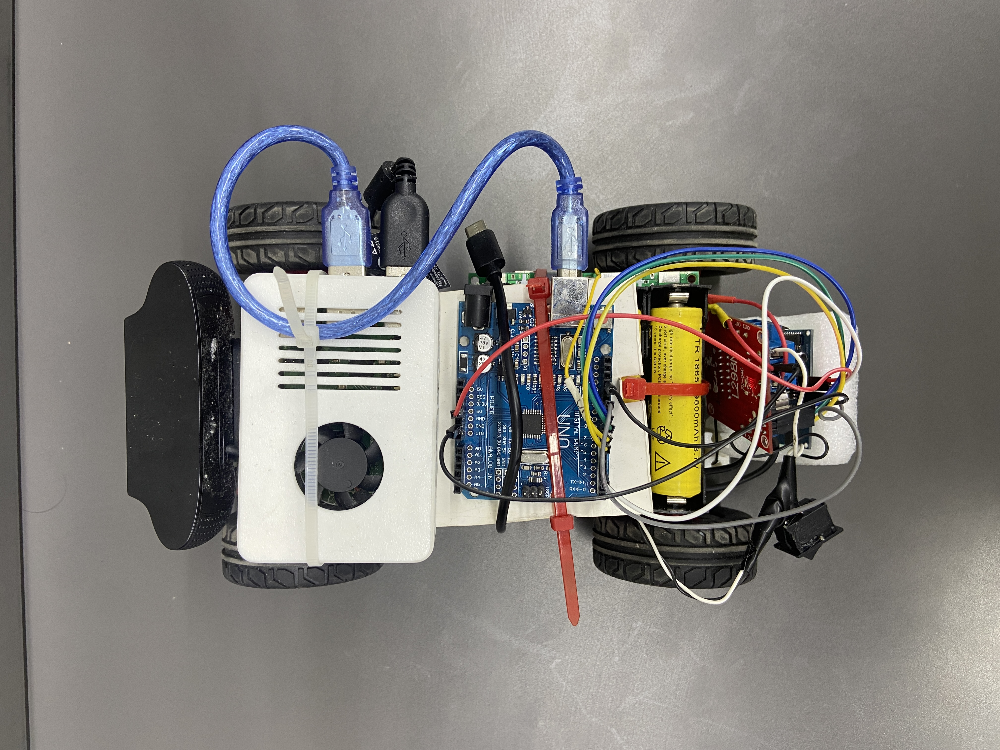
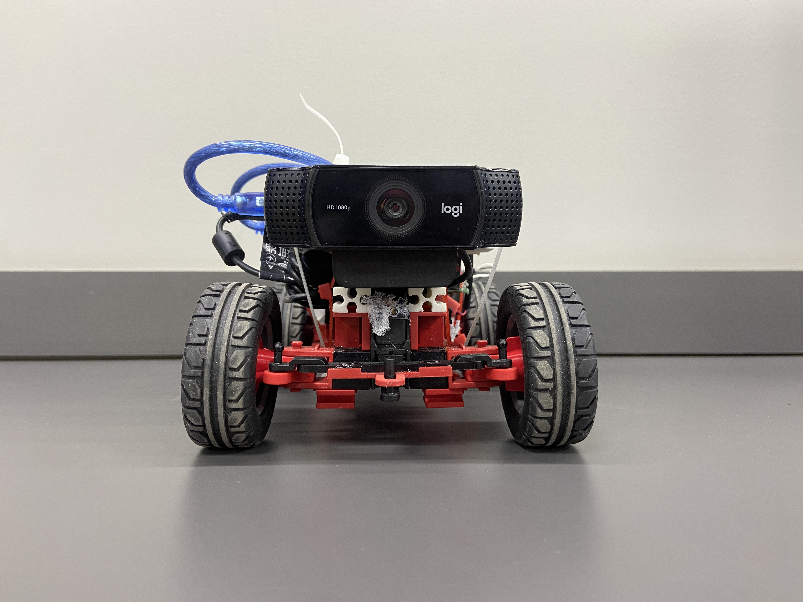
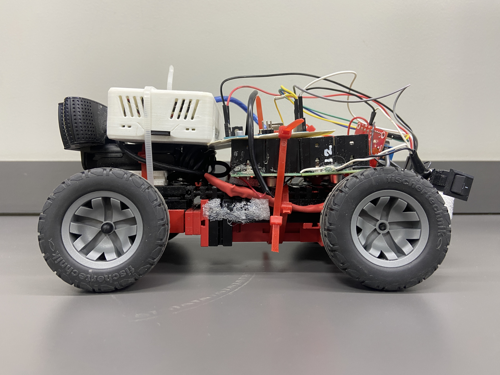
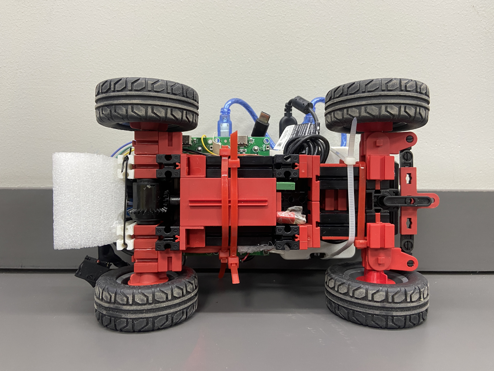
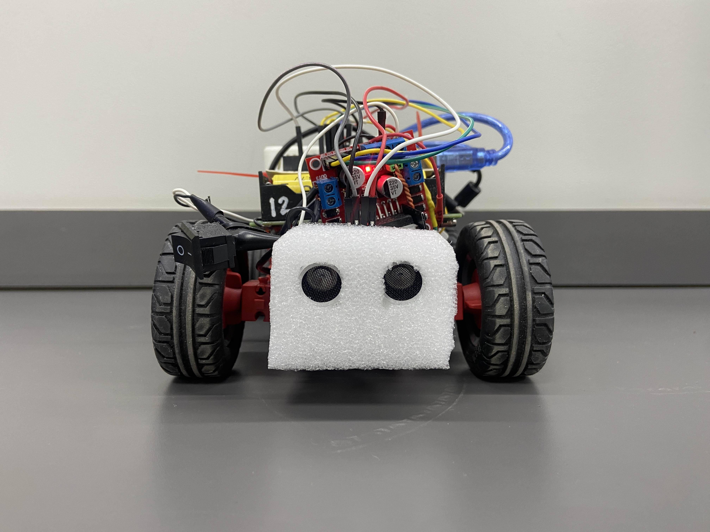
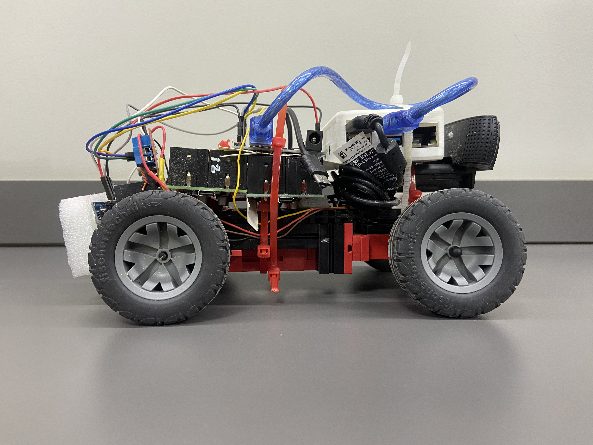

# WRO2026 Futuros Ingenieros – Ingenieros Paralelos

## Acerca de Nosotros

>Integrantes del equipo
- Samuel Guaimacuto
- Andrés Villareal
- David Xu

_Somos un equipo venezolano conformado por estudiantes de ingeniería informática de la Universidad Gran de Ayacucho (UGMA), núcleo Barcelona, siendo esta nuestra primera vez participando en una competición WRO, compitiendo en la categoría Futuros Ingenieros. Nuestra inspiración de formar parte de este torneo fue el deseo de aprender acerca del mundo de la robótica, queriendo enfrentarnos a desafíos para lograrlo. Estamos agradecidos con toda nuestra familia, profesores y compañeros, ya que sin el apoyo de ellos no hubiésemos logrado lo que nos propusimos_.



<hr>

## Tabla de Contenido

<!-- toc -->

- [Vista previa del carro](#vista-previa-del-carro)
- [Componentes usados y precio estimado](#componentes-usados-y-precio-estimado)
- [Manejo de la visión](#manejo-de-la-visión)
  - [Cámara Web Logitech C922](#cámara-web-logitech-c922)
  - [Raspberry Pi 4](#raspberry-pi-4)
- [Manejo de la movilidad](#manejo-de-la-movilidad)
  - [Arduino Uno](#arduino-uno)
  - [Driver L298N](#driver-l298n)
  - [Fischertechnik Maker Kit Car](#fischertechnik-maker-kit-car)
  - [Mecanismo Ackermann](#mecanismo-ackermann)
  - [Principio Ackermann](#principio-ackermann)
  - [Ackermann en nuestro proyecto](#ackermann-en-nuestro-proyecto)
- [Manejo de las Fuentes de Energia](#manejo-de-las-fuentes-de-energia)
  - [UPS LX-2BUPS](#ups-lx-2bups)
  - [Baterías Ultrafire TR 18650](#baterías-ultrafire-tr-18650)
- <a href="src"> Manejo de obstáculos </a>

<!-- tocstop -->

<hr>

## Vista previa del carro

<table>
  <tr>
    <td align="center"><b>Superior</b><br></td>
    <td align="center"><b>Frontal</b><br></td>
    <td align="center"><b>Izquierda</b><br></td>
  </tr>
  <tr>
    <td align="center"><b>Inferior</b><br></td>
    <td align="center"><b>Trasera</b><br></td>
    <td align="center"><b>Derecha</b><br></td>
  </tr>
</table>

<hr>

## Componentes usados y precio estimado

| Componente | Cantidad | Precio Estimado por Unidad | Subtotal Estimado | Referencia |
|---|---:|---:|---:|---|
| Raspberry Pi 4 Modelo B 4GB Kit | 1 | $200.00 | $200.00 | MercadoLibre Venezuela |
| Arduino Uno R3 | 1 | $9.99 | $9.99 | MercadoLibre Venezuela |
| Driver de Motor L298N | 1 | $6.99 | $6.99 | MercadoLibre Venezuela |
| Cámara Logitech C922 | 1 | $70.00 | $70.00 | MercadoLibre Venezuela |
| Módulo UPS LX-2BUPS | 1 | $17.80 | $17.80 | MercadoLibre Venezuela |
| Batería 18650 3.7V | 4 | $5.00 | $20.00 | MercadoLibre Venezuela |
| Fischertechnik Maker Kit Car | 1 | $115.33 | $115.33 | eBay |

### Total Estimado: $443.10

<hr>

## Manejo de la visión

- #### Cámara Web Logitech C922

<table>
  <tr>
    <td align="center" width="300" >
      
    </td>
    <td>
      <h3>Especificaciones:</h3>
      <ul>
        <li>Resolución máxima: 1080p a 30 fps (Full HD) o 720p a 60 fps (HD)</li>
        <li>Campo de visión (FoV): 78° en diagonal</li>
        <li>Tipo de enfoque: Enfoque automático</li>
        <li>Tecnología de la lente: Lente de cristal Full HD con corrección automática de la luz</li>
        <li>Audio: Micrófonos estéreo omnidireccionales duales</li>
        <li>Conectividad: USB 2.0 con cable (incluye un cable de 1,5 m)</li>
      </ul>
    </td>
  </tr>
</table>

La Logitech C922 es una cámara web de gran popularidad con alta definición diseñada especialmente para creadores de contenido, streamers y profesionales. Ofrece una resolución de video nítida, una velocidad de fotogramas fluida para un movimiento sin interrupciones y la capacidad de corrección en baja iluminación. <b>En nuestro proyecto, la utilizamos como el ojo del carro, capturando la vista del entorno para que se pudiesen realizar acciones como la identificación de esquinas y detección de objetos, de tal manera que las fotos tomadas por la cámara pudiesen ser procesadas posteriormente por el software presente en la Raspberry. Se decidió optar por esta como el ojo del vehículo debido a las buenas reseñas que encontramos investigando acerca de posibles cámaras que se podían emplear.</b>

<hr>

- #### Raspberry Pi 4

<table>
  <tr>
    <td align="center" width="300" >
      
    </td>
    <td>
      <h3>Especificaciones:</h3>
      <ul>
        <li>Procesador: SoC Cortex-A72 de cuatro núcleos (ARM v8) de 64 bits a 1,5–1,8 GHz</li>
        <li>Memoria: 4 GB de SDRAM LPDDR4-3200</li>
        <li>Vídeo: Dos puertos micro-HDMI compatibles con 4K a 60 fps</li>
        <li>Conectividad: Gigabit Ethernet, Wi-Fi de 2,4/5,0 GHz y Bluetooth 5.0</li>
        <li>USB: 2 puertos USB 3.0 y 2 puertos USB 2.0</li>
        <li>Alimentación: Compatible con USB-C (5 V/3 A) o alimentación a través de Ethernet (PoE)</li>
      </ul>
    </td>
  </tr>
</table>

La Raspberry Pi 4 Modelo B es una computadora de placa única del tamaño de una tarjeta de crédito. Funciona como una computadora de bajo costo totalmente operativa, capaz de realizar tareas de computación de escritorio, transmisión de contenido multimedia, automatización del hogar y de robótica, utilizando solo una fracción de la potencia de una computadora de escritorio estándar. <b>Este componente actúa como el cerebro del vehículo, con el software implementado tiene la capacidad de procesar las imágenes de la cámara web, decidiendo cual es la acción más apropiada a ejecutar dependiendo del entorno en el que se encuentre el carro, para que luego nuestro microcontrolador, el Arduino Uno, la ejecute</b>.

<a href="src"> Ver el código implementado en la Raspberry </a>

<hr>

## Manejo de la movilidad

- #### Arduino Uno

<table>
  <tr>
    <td align="center" >
      
    </td>
    <td>
      <h3>Especificaciones:</h3>
      <ul>
        <li> Microcontrolador: ATmega328P </li>
        <li> Voltaje de funcionamiento: 5 V </li>
        <li> Voltaje de entrada (recomendado): 7 V a 12 V </li>
        <li> Voltaje de entrada (límite): 6 V a 20 V </li>
        <li> Pines de E/S digitales: 14 (6 proporcionan salida PWM) </li>
        <li> Pines de entrada analógica: 6 </li>
        <li> Corriente continua por pin de Entrada/Salida: 20 mA </li>
        <li> Velocidad de reloj: 16 MHz </li>
        <li> Memoria flash: 32 KB (de los cuales 0,5 KB son utilizados por el gestor de arranque) </li>
        <li> SRAM: 2 KB </li>
        <li> EEPROM: 1 KB </li>
      </ul>
    </td>
  </tr>
</table>

El Arduino Uno es una placa microcontroladora de código abierto, ideal para principiantes, que se utiliza para construir dispositivos digitales y proyectos interactivos. Permite leer entradas como las de un sensor, un botón o la lectura de temperatura, y convertirlas en salidas, como mover un motor o encender un LED. <b>Este hardware actúa como el sistema nervioso de nuestro coche debido a que este es el componente que recibe todas las decisiones tomadas por el cerebro, la Raspberry, enviando pequeños impulsos eléctricos al driver para indicarle cuándo y de qué manera debe mover los motores. Dado que es nuestra primera vez participando en este tipo de torneos, decidimos empezar probando este modelo de Arduino</b>.

<a href="src"> Ver el código implementado en el Arduino </a>

<hr>

- #### Driver L298N

<table>
  <tr>
    <td align="center" width="300" >
      
    </td>
    <td>
      <h3>Especificaciones:</h3>
      <ul>
        <li> Driver IC: STMicroelectronics L298N </li>
        <li> Tensión de alimentación del motor (Vs): 5 V a 35 V </li>
        <li> Corriente de salida máxima: 2 A por canal (4 A máx. total) </li>
        <li> Tensión de alimentación lógica (Vss): 5 V a 7 V </li>
        <li> Disipación de potencia máxima: 20 W a 75 °C </li>
        <li> Nivel de señal de control: Bajo (-0,3 V a 1,5 V), Alto (2,3 V a Vss) </li>
      </ul>
    </td>
  </tr>
</table>

El L298N es un módulo controlador de motor de doble Puente H, que se utilizan para manejar la dirección del flujo de corriente elétrica, permitiendo que nuestro vehículo de desplace izquierda-derecha o de reversa y no solo hacia adelante. Sirve como puente entre el microcontrolador, el Arduino Uno, y los motores de alta potencia (en nuestro caso, el servomotor y el motor del codificador), suministrando la corriente y el voltaje necesarios. <b>Este componente actúa como los músculos del coche, proporcionando el voltaje necesario a los motores, pero dado que el Arduino y la Raspberry Pi manejan un voltaje bajo (insuficiente para alimentar el controlador), es necesaria la implementación de una fuente de alimentación adicional para este componente</b>.

<hr>

- #### Fischertechnik Maker Kit Car


El Fischertechnik Maker Kit Car es un kit de construcción avanzado diseñado para aficionados de la robótica, que da la libertad de construir un chasis de vehículo robótico móvil personalizable. Incluye piezas para construir estructuras robustas y soportes personalizados, por lo que aprovechamos esto utilizando los bloques del kit como base o esqueleto de nuestro coche para luego ensamblar el resto de los componentes alrededor de ellos.

<h3> Otros componentes que el kit contiene </h3>

> Servomotor

<a href="schemes/Fistchertechnik Maker Kit Car/BA_DATENBLATT_MAKER_KIT_CAR_ENCODERMOTOR.pdf">Ver especificaciones</a>

Se trata de un motor especializado diseñado para girar a un ángulo específico, en este caso entre 60° y 120° y mantener dicha posición. Se conecta directamente a las manguetas delanteras de nuestro chasis, y estas a ambas ruedas delanteras, controlando también el mecanismo de dirección. A diferencia del motor de tracción, no está diseñado para girar de manera contínua, en cambio este gira cuando se le ordena cambiar de ángulo, proporcionando al vehículo la capacidad de cambiar de dirección (izquierda-derecha).

> Motor Codificador o Motor C

<a href="schemes/Fistchertechnik Maker Kit Car/BA_DATENBLATT_MAKER_KIT_CAR_ENCODERMOTOR.pdf">Ver especificaciones</a>

Es el motor principal del vehículo. Proporciona la potencia motriz (tracción) para que el coche avance y retroceda. Este motor alimenta las llantas traseras de nuestro vehículo, significando que estas son las que poseen tracción.

> Engranaje Diferencial

Consiste en una caja de cambios mecánica ubicada entre las dos ruedas motrices, en nuestro caso las ruedas traseras. Permite que las ruedas izquierda y derecha giren a velocidades diferentes mientras reciben potencia del motor. Al girar el coche, la rueda exterior recorre una mayor distancia que la interior. Sin un diferencial, las ruedas se bloquearían, patinarían o derraparían durante las curvas. Este componente garantiza un paso por curva suave y realista, y evita que el coche pierda tracción.

<hr>

- #### Mecanismo Ackermann


Cuando un carro gira, las ruedas delanteras siguen trayectorias con radios diferentes. La rueda interior describe un círculo más cerrado (radio menor), mientras que la exterior describe un arco más amplio (radio mayor). Si ambas ruedas apuntan exactamente en la misma dirección (paralelas entre sí), la rueda interior tiende a arrastrarse o deslizarse lateralmente, ya que se ve forzada a seguir una trayectoria que no le corresponde. Esto genera desgaste prematuro de los neumáticos, mayor esfuerzo de dirección, pérdida de estabilidad y agarre, y mayor radio de giro del vehículo. El mecanismo de Ackermann resuelve este inconveniente haciendo que las ruedas adopten ángulos diferentes automáticamente en el momento cuando las ruedas direccionales giran hacia la izquierda o derecha.

<hr>

- #### Principio Ackermann

El principio de Ackermann se basa en una condición geométrica conocida como la condición de Ackermann. En un giro perfecto, los ejes de todas las ruedas deben intersectarse en un único punto común situado en la prolongación del eje trasero. Este punto es el centro instantáneo de rotación del vehículo. Esto implica que la rueda delantera interior debe girar con un ángulo mayor (αᵢ), mientras que la rueda delantera exterior debe girar con un ángulo menor (αₑ).

La relación entre ambos ángulos viene dada por la fórmula:

```text
cot(αₑ) - cot(αᵢ) = d / L
```

Donde:

d = distancia entre los puntos de pivote de las ruedas (ancho de vía)

L = distancia entre ejes (distancia entre ejes)

Esta relación garantiza que, para cualquier ángulo de giro, el centro de curvatura permanezca sobre la línea del eje trasero, evitando el arrastre lateral de las ruedas.

<hr>

- #### Ackermann en nuestro proyecto

Nuestro coche no cuenta con la presencia de este mecanismo, o también puede ser denominado 0% Ackermann. Esto no afecta mucho al rendimiento, ya que se trata de un vehículo pequeño, pero si lo incluyéramos en el proyecto, nos ayudaría a mejorar los tiempos, por otra parte también se podrían evitar problemas con el desgaste de las llantas. En base a lo investigado, son varias las razones por las que el kit no trae este mecanismo incluido:

1. Es un kit básico de iniciación, pues el Maker Kit Car está diseñado con el propósito de cumplir la función de un chasis base, robusto y fácil de ampliar, no como un modelo a escala de alto rendimiento.

2. Prioridad de funcionalidad educativa: su objetivo principal es servir como plataforma para integrar placas de desarrollo, como Arduino y Raspberry Pi, y aprender sobre robótica y programación, por el hecho de que un sistema de dirección más sencillo, como una mangueta con un servomotor, es más fácil de construir y programar para un individuo no muy conocedor acerca del área.

3. Diferenciación del producto: Fischertechnik reserva el mecanismo Ackermann para sus kits más avanzados, orientados a la competición, como el STEM Coding Competition, que tienen un precio y una complejidad mucho mayores. El Maker Kit Car, con sus 119 piezas, es una opción más accesible y rentable para proyectos creativos.

4. Costo y simplicidad de fabricación: Un mecanismo Ackermann completo requiere más piezas (brazos de dirección angulados, barras de acoplamiento adicionales, geometría precisa) que una simple mangueta con servomotor, lo que aumenta el costo de producción y la complejidad del montaje.

5. Público objetivo: El kit está dirigido a aficionados y creadores que desean experimentar con la electrónica y la programación, no necesariamente a estudiantes de ingeniería que busquen una reproducción exacta de la dinámica de un vehículo.

<hr>

## Manejo de las Fuentes de Energia

- #### UPS LX-2BUPS

<table>
  <tr>
    <td align="center" width="300" >
      
    </td>
    <td>
      <h3>Especificaciones:</h3>
      <ul>
        <li> Tipo de batería: Dos baterías de iones de litio 18650 en paralelo (3,7V) </li>
        <li> Voltaje de salida: Generalmente disponible en versiones de 5V, 9V o 12V </li>
        <li> Corriente máxima de salida: 3A </li>
        <li> Potencia máxima de salida: De 15W a 24W </li>
        <li> Voltaje de entrada: CC estándar de 5 V (a través de Micro USB o USB Tipo-C, según la variante de la placa) </li>
      </ul>
    </td>
  </tr>
</table>

El LX-2BUPS es un popular módulo de alimentación ininterrumpida. Funciona con dos baterías de iones de litio 18650 conectadas en paralelo y proporciona un intercambio instantáneo y sin retardo entre la alimentación de red y la batería de respaldo, lo que lo hace ideal para mantener en funcionamiento dispositivos de bajo consumo en el hogar como routers y módems de internet durante cortes de luz. Utilizamos dos piezas de este componente, uno de 5 V para la Raspberry Pi y otro de 12 V para el driver.

<hr>

- #### Baterías Ultrafire TR 18650

<table>
  <tr>
    <td align="center" width="300" >
      
    </td>
    <td>
      <h3>Especificaciones:</h3>
      <ul>
        <li> Factor de forma: Celda cilíndrica estándar 18650. </li>
        <li> Diámetro: 18 mm. </li>
        <li> Longitud: 65 mm (puede alcanzar hasta 68 mm si incluye un polo positivo tipo botón o un circuito de protección no especificado). </li>
        <li> Química: Iones de litio (Li-ion). </li>
        <li> Tipo de terminal: Polo positivo plano o tipo botón (varía según el distribuidor). </li>
        <li> Voltaje nominal: 3,7 V (Curva estándar de iones de litio: 4,2 V con carga completa, ~2,75 V de corte). </li>
        <li> Capacidad declarada: 9800 mAh. </li>
      </ul>
    </td>
  </tr>
</table>

En el proyecto utilizamos cuatro de estas baterías, dos para cada UPS. Son baterías recargables, las recargamos conectándolas al UPS con un cargador USB-C de 20 W (que admite 9 V / 2,22 A).

<hr>

## Puntos a mejorar en nuestro proyecto

Después de esta primera experiencia en una competición WRO y a lo largo de nuestro camino de preparación para estos torneos, nos pudimos dar cuenta de puntos muy clave que se pueden optimizar del carro desarrollado:

1. Chasis del carro: El chasis de nuestro carro nos trajo una serie de dificultades como la limitación del espacio para ubicar los componentes necesarios, desgaste en los dientes del eje diferencial, en las llantas, entre otros aspectos. Para una futura competición, nos gustaría personalizar más nuestro chasis, diseñando e imprimiendo las piezas en 3D que creamos que sean necesarias para el ensamblaje del vehículo. Nos parece de agrado esta idea debido a que consideramos que planificando el diseño y el uso de cada parte del chasis nos evitaríamos una cantidad considerable de inconvenientes que se nos presentaron en esta jornada.

2. Motor codificador más eficiente: Implementando un motor capaz de girar a mayores revoluciones por minuto para alimentar las ruedas con tracción, conseguiríamos mejorar los tiempos para los desafíos, pues el motor codificador usado en esta temporada nos limitó el logro de mejores tiempos. Consideramos que empleando un motor de este tipo pero que acepte mayor voltaje podría solucionar dicho problema.

3. Posible implementación de un Mecanismo Ackermann: En caso de usar un motor codificador capaz de entregarle una mayor cantidad de revoluciones por minuto a las ruedas de nuestro carro, probablemente diseñemos este mecanismo en 3D como parte de nuestro chasis personalizado, esto con el fin de evitar tanto desgaste en las llantas y hacer más estable el vehículo, de tal manera que no resbale o patine, pudiendo influir en su rendimiento sobre la pista.

<hr>

### Fin de la sección principal, <a href="src"> haz click aqui para ver detalles acerca del software implementado</a>.
