# WRO2026 Futuros Ingenieros – Ingenieros Paralelos

## Acerca de Nosotros

>Integrantes del equipo
- Samuel Guaimacuto
- Andrés Villareal
- David Xu

_Somos un equipo venezolano conformado por estudiantes de ingeniería informática de la Universidad Gran de Ayacucho (UGMA), núcleo Barcelona, siendo esta nuestra primera vez participando en una competición WRO, compitiendo en la categoría Futuros Ingenieros. Nuestra inspiración de formar parte de este torneo fue el deseo de aprender acerca del mundo de la robótica, queriendo enfrentarnos a desafíos para lograrlo. Estamos agradecidos con toda nuestra familia, profesores y compañeros, ya que sin el apoyo de ellos no hubiésemos logrado lo que nos propusimos_.


<hr>

## Tabla de Contenido

<!-- toc -->

- [Vista previa del carro](#vista-previa-del-carro)
- [Componentes usados y precio estimado](#componentes-usados-y-precio-estimado)
- [Manejo de la visión](#manejo-de-la-visión)
  - [Cámara Web Logitech C922](#cámara-web-logitech-c922)
  - [Raspberry Pi 4](#raspberry-pi-4)
- [Manejo de la movilidad](#manejo-de-la-movilidad)
  - [Arduino Uno](#arduino-uno)
  - [Driver L298N](#driver-l298n)
  - [Fischertechnik Maker Kit Car](#fischertechnik-maker-kit-car)
  - [Mecanismo Ackermann](#mecanismo-ackermann)
  - [Principio Ackermann](#principio-ackermann)
  - [Ackermann en nuestro proyecto](#ackermann-en-nuestro-proyecto)
- [Manejo de las Fuentes de Energia](#manejo-de-las-fuentes-de-energia)
  - [UPS LX-2BUPS](#ups-lx-2bups)
  - [Baterías Ultrafire TR 18650](#baterías-ultrafire-tr-18650)
- [Descripción del Software](#descripción-del-software)
- [Objetivo del Software](#objetivo-del-software)
- [Arquitectura del Robot](#arquitectura-del-robot)
  - [Distribución Funcional](#distribución-funcional)
  - [Flujo del Sistema Físico](#flujo-del-sistema-físico)
  - [Conexión de Software a Hardware](#conexión-de-software-a-hardware)
- [Acerca del Software Implementado](#acerca-del-software-implementado)
  - [Script del Modo 1](#script-del-modo-1)
  - [Script del Modo 2](#script-del-modo-2)
  - [Script de Arduino](#script-de-arduino)
  - [Script de Calibración](#script-de-calibración)
- [Resumen del Software Implementado](#resumen-del-software-implementado)
- [Puntos a mejorar en nuestro proyecto](#puntos-a-mejorar-en-nuestro-proyecto)
- [Nuestras experiencias en las regionales](#nuestras-experiencias-en-las-regionales)

<!-- tocstop -->

<hr>

## Vista previa del carro

<table>
  <tr>
    <td align="center"><b>Superior</b><br>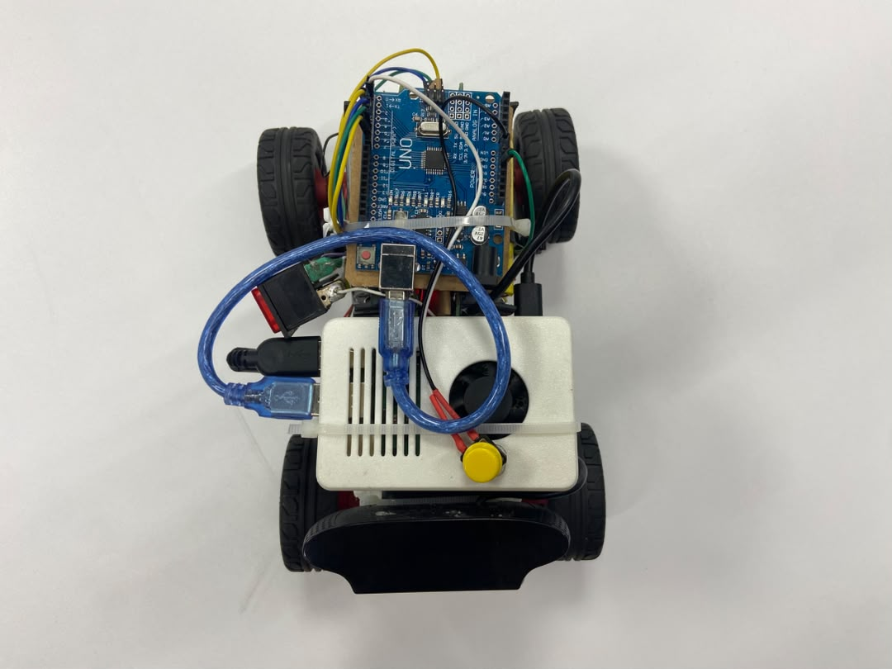</td>
    <td align="center"><b>Frontal</b><br>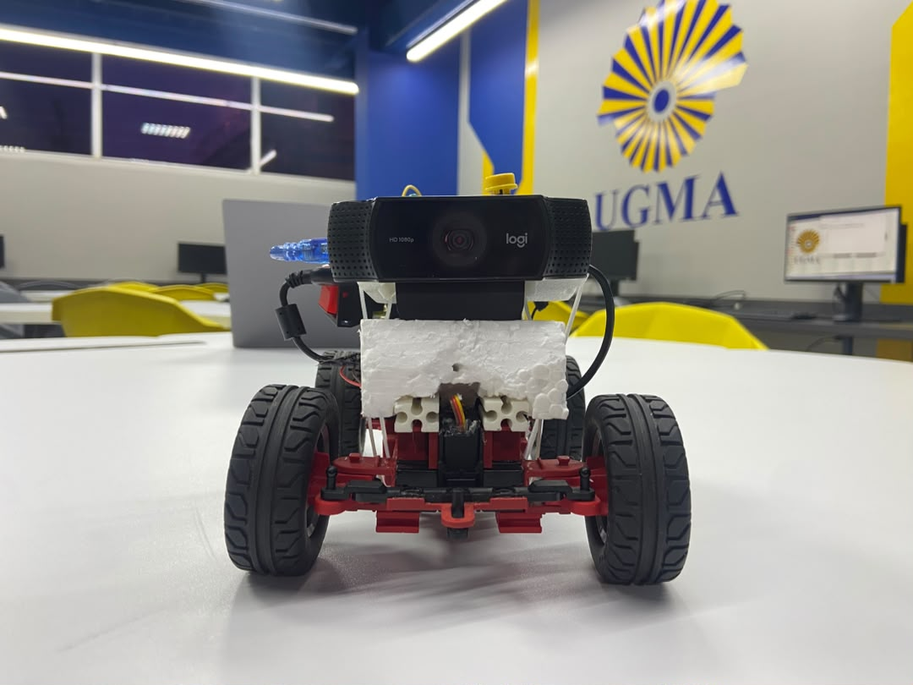</td>
    <td align="center"><b>Izquierda</b><br>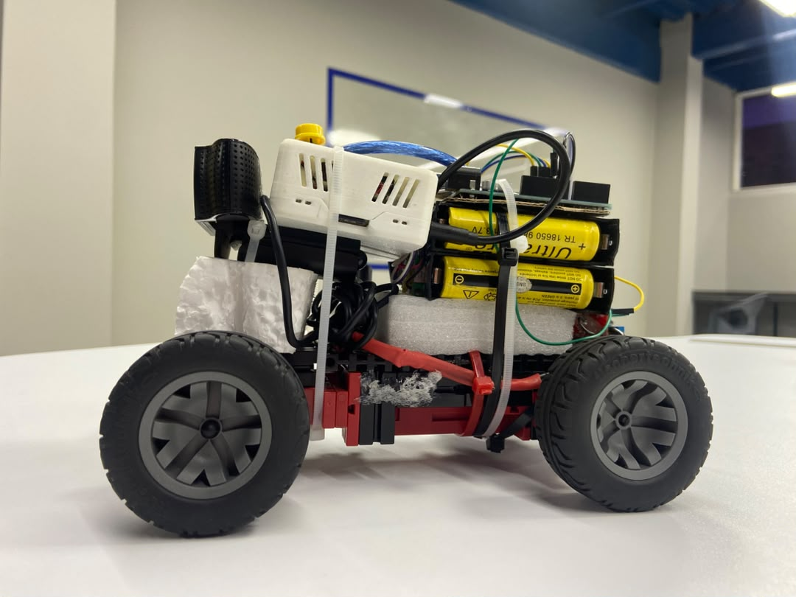</td>
  </tr>
  <tr>
    <td align="center"><b>Inferior</b><br>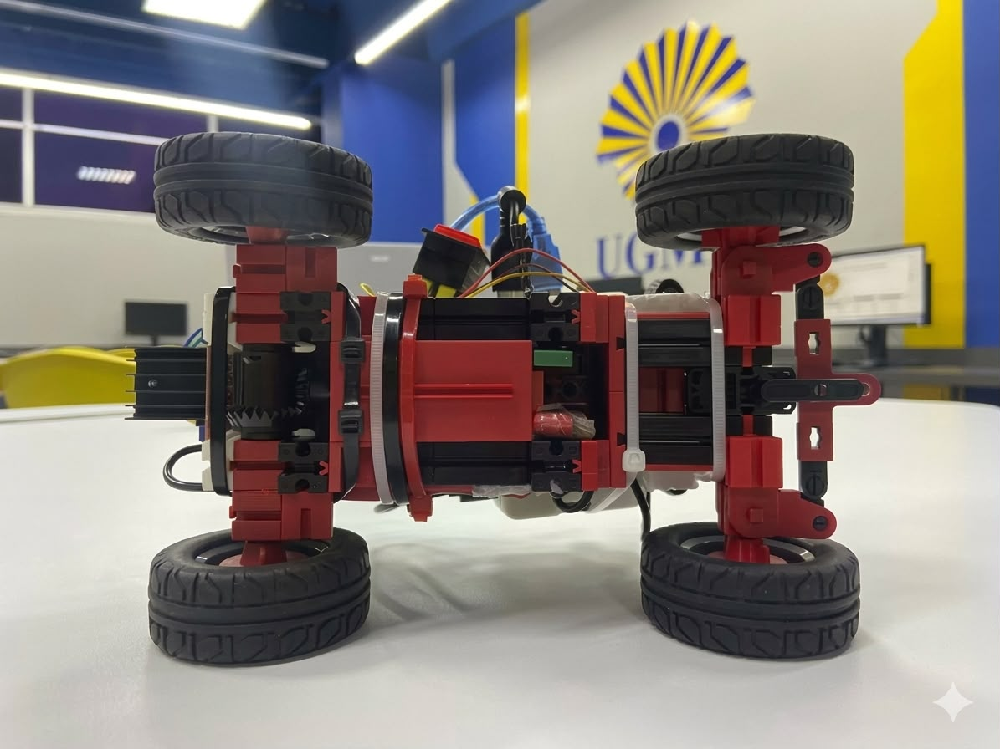</td>
    <td align="center"><b>Trasera</b><br>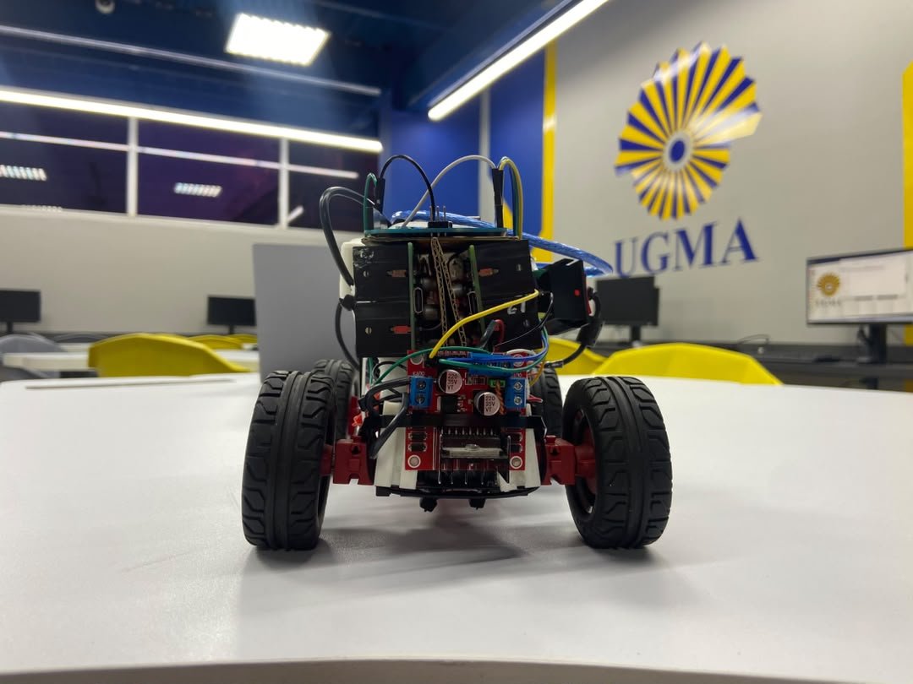</td>
    <td align="center"><b>Derecha</b><br>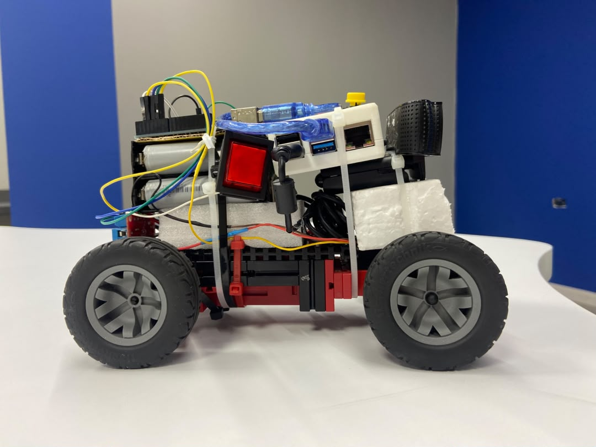</td>
  </tr>
</table>

<hr>

## Componentes usados y precio estimado

| Componente | Cantidad | Precio Estimado por Unidad | Subtotal Estimado | Referencia |
|---|---:|---:|---:|---|
| Raspberry Pi 4 Modelo B 4GB Kit | 1 | $200.00 | $200.00 | MercadoLibre Venezuela |
| Arduino Uno R3 | 1 | $9.99 | $9.99 | MercadoLibre Venezuela |
| Driver de Motor L298N | 1 | $6.99 | $6.99 | MercadoLibre Venezuela |
| Cámara Logitech C922 | 1 | $70.00 | $70.00 | MercadoLibre Venezuela |
| Módulo UPS LX-2BUPS | 2 | $17.80 | $35.60 | MercadoLibre Venezuela |
| Batería 18650 3.7V | 4 | $5.00 | $20.00 | MercadoLibre Venezuela |
| Fischertechnik Maker Kit Car | 1 | $115.33 | $115.33 | eBay |

### Total Estimado: $457.88

<hr>

## Manejo de la visión

- #### Cámara Web Logitech C922

<table>
  <tr>
    <td align="center" width="300" >
      
    </td>
    <td>
      <h3>Especificaciones:</h3>
      <ul>
        <li>Resolución máxima: 1080p a 30 fps (Full HD) o 720p a 60 fps (HD)</li>
        <li>Campo de visión (FoV): 78° en diagonal</li>
        <li>Tipo de enfoque: Enfoque automático</li>
        <li>Tecnología de la lente: Lente de cristal Full HD con corrección automática de la luz</li>
        <li>Audio: Micrófonos estéreo omnidireccionales duales</li>
        <li>Conectividad: USB 2.0 con cable (incluye un cable de 1,5 m)</li>
      </ul>
    </td>
  </tr>
</table>

La Logitech C922 es una cámara web de gran popularidad con alta definición diseñada especialmente para creadores de contenido, streamers y profesionales. Ofrece una resolución de video nítida, una velocidad de fotogramas fluida para un movimiento sin interrupciones y la capacidad de corrección en baja iluminación. <b>En nuestro proyecto, la utilizamos como el ojo del carro, capturando la vista del entorno para que se pudiesen realizar acciones como la identificación de esquinas y detección de objetos, de tal manera que las fotos tomadas por la cámara pudiesen ser procesadas posteriormente por el software presente en la Raspberry. Se decidió optar por esta como el ojo del vehículo debido a las buenas reseñas que encontramos investigando acerca de posibles cámaras que se podían emplear.</b>

> [!NOTE]
>- La cámara fue calibrada en el script del modo 1 (en el modo 2 no se le da uso a la cámara) basándose en los valores de los colores obtenidos en el script de calibración.

<hr>

- #### Raspberry Pi 4

<table>
  <tr>
    <td align="center" width="300" >
      
    </td>
    <td>
      <h3>Especificaciones:</h3>
      <ul>
        <li>Procesador: SoC Cortex-A72 de cuatro núcleos (ARM v8) de 64 bits a 1,5–1,8 GHz</li>
        <li>Memoria: 4 GB de SDRAM LPDDR4-3200</li>
        <li>Vídeo: Dos puertos micro-HDMI compatibles con 4K a 60 fps</li>
        <li>Conectividad: Gigabit Ethernet, Wi-Fi de 2,4/5,0 GHz y Bluetooth 5.0</li>
        <li>USB: 2 puertos USB 3.0 y 2 puertos USB 2.0</li>
        <li>Alimentación: Compatible con USB-C (5 V/3 A) o alimentación a través de Ethernet (PoE)</li>
      </ul>
    </td>
  </tr>
</table>

La Raspberry Pi 4 Modelo B es una computadora de placa única del tamaño de una tarjeta de crédito. Funciona como una computadora de bajo costo totalmente operativa, capaz de realizar tareas de computación de escritorio, transmisión de contenido multimedia, automatización del hogar y de robótica, utilizando solo una fracción de la potencia de una computadora de escritorio estándar. <b>Este componente actúa como el cerebro del vehículo, con el software implementado tiene la capacidad de procesar las imágenes de la cámara web, decidiendo cual es la acción más apropiada a ejecutar dependiendo del entorno en el que se encuentre el carro, para que luego nuestro microcontrolador, el Arduino Uno, la ejecute</b>.

<a href="https://www.youtube.com/watch?v=o2TZHPnM0VQ"> Tutorial para configurar una Raspberry Pi 4 </a> (Si el link no funciona se puede buscar otro tutorial)

> [!NOTE]
>- En las imágenes de nuestro carro se puede apreciar que nuestra Raspberry se encuentra en una carcasa con un mini ventilador.
>- La universidad nos brindó este componente en este estado y tampoco se pudo verificar el origen de esta envoltura.

Se nos hizo más cómodo trabajar desde la terminal de la Raspberry ya que se hacía más lento moverse dentro de la interfaz. Dentro de los comandos que usamos se encuentran los siguientes:

- `sudo find / -name "nombre_del_archivo"`: para buscar dónde se encuentra un archivo.
- `cd nombre_directorio`: para moverse a una carpeta específica.
- `cat archivo`: para ver el contenido de un archivo.
- `nano archivo`: para editar archivo desde la terminal.
- `sudo systemctl start robot.service`: para inciar la ejecución del programa.
- `sudo systemctl stop robot.service`: para parar la ejecución del programa.

> [!IMPORTANT]
>- El archivo robot.service se encuentra en la carpeta src de nuestro repositorio, en ese archivo se puede editar el archivo de Python que se va a ejecutar al presionar el botón, el cual definimos en base al modo que nos estemos enfrentando.

<hr>

## Manejo de la movilidad

- #### Arduino Uno

<table>
  <tr>
    <td align="center" >
      
    </td>
    <td>
      <h3>Especificaciones:</h3>
      <ul>
        <li> Microcontrolador: ATmega328P </li>
        <li> Voltaje de funcionamiento: 5 V </li>
        <li> Voltaje de entrada (recomendado): 7 V a 12 V </li>
        <li> Voltaje de entrada (límite): 6 V a 20 V </li>
        <li> Pines de E/S digitales: 14 (6 proporcionan salida PWM) </li>
        <li> Pines de entrada analógica: 6 </li>
        <li> Corriente continua por pin de Entrada/Salida: 20 mA </li>
        <li> Velocidad de reloj: 16 MHz </li>
        <li> Memoria flash: 32 KB (de los cuales 0,5 KB son utilizados por el gestor de arranque) </li>
        <li> SRAM: 2 KB </li>
        <li> EEPROM: 1 KB </li>
      </ul>
    </td>
  </tr>
</table>

El Arduino Uno es una placa microcontroladora de código abierto, ideal para principiantes, que se utiliza para construir dispositivos digitales y proyectos interactivos. Permite leer entradas como las de un sensor, un botón o la lectura de temperatura, y convertirlas en salidas, como mover un motor o encender un LED. <b>Este hardware actúa como el sistema nervioso de nuestro coche debido a que este es el componente que recibe todas las decisiones tomadas por el cerebro, la Raspberry, enviando pequeños impulsos eléctricos al driver para indicarle cuándo y de qué manera debe mover los motores. Dado que es nuestra primera vez participando en este tipo de torneos, decidimos empezar probando este modelo de Arduino</b>.

> [!NOTE]
>- Nosotros tuvimos que usar una extensión del navegador Google Chrome para poder acceder a la página "arduino.cc" para descargar el software para configurar las instrucciones a ejecutar en el Arduino Uno debido a que no se puede acceder de manera local, este se llama "CyberGhost VPN - Proxy For Chrome". 

<hr>

- #### Driver L298N

<table>
  <tr>
    <td align="center" width="300" >
      
    </td>
    <td>
      <h3>Especificaciones:</h3>
      <ul>
        <li> Driver IC: STMicroelectronics L298N </li>
        <li> Tensión de alimentación del motor (Vs): 5 V a 35 V </li>
        <li> Corriente de salida máxima: 2 A por canal (4 A máx. total) </li>
        <li> Tensión de alimentación lógica (Vss): 5 V a 7 V </li>
        <li> Disipación de potencia máxima: 20 W a 75 °C </li>
        <li> Nivel de señal de control: Bajo (-0,3 V a 1,5 V), Alto (2,3 V a Vss) </li>
      </ul>
    </td>
  </tr>
</table>

El L298N es un módulo controlador de motor de doble Puente H, que se utilizan para manejar la dirección del flujo de corriente elétrica, permitiendo que nuestro vehículo de desplace izquierda-derecha o de reversa y no solo hacia adelante. Sirve como puente entre el microcontrolador, el Arduino Uno, y los motores de alta potencia (en nuestro caso, el servomotor y el motor del codificador), suministrando la corriente y el voltaje necesarios. <b>Este componente actúa como los músculos del coche, proporcionando el voltaje necesario a los motores, pero dado que el Arduino y la Raspberry Pi manejan un voltaje bajo (insuficiente para alimentar el controlador), es necesaria la implementación de una fuente de alimentación adicional para este componente</b>.

<hr>

- #### Fischertechnik Maker Kit Car


El Fischertechnik Maker Kit Car es un kit de construcción avanzado diseñado para aficionados de la robótica, que da la libertad de construir un chasis de vehículo robótico móvil personalizable. Incluye piezas para construir estructuras robustas y soportes personalizados, por lo que aprovechamos esto utilizando los bloques del kit como base o esqueleto de nuestro coche para luego ensamblar el resto de los componentes alrededor de ellos.

<h3> Otros componentes que el kit contiene </h3>

> Servomotor

Se trata de un motor especializado diseñado para girar a un ángulo específico, en este caso entre 60° y 120° y mantener dicha posición. Se conecta directamente a las manguetas delanteras de nuestro chasis, y estas a ambas ruedas delanteras, controlando también el mecanismo de dirección. A diferencia del motor de tracción, no está diseñado para girar de manera contínua, en cambio este gira cuando se le ordena cambiar de ángulo, proporcionando al vehículo la capacidad de cambiar de dirección (izquierda-derecha).

<table>
  <tr>
    <td align="center">
      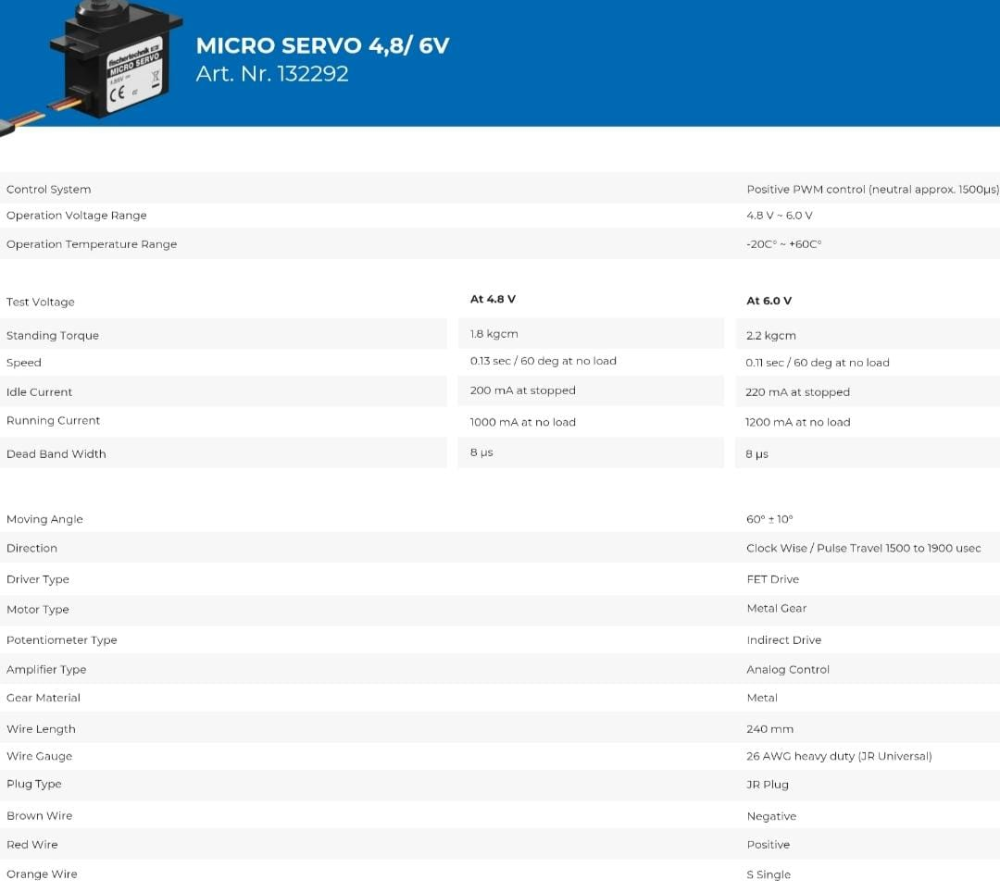
    </td>
    <td>
      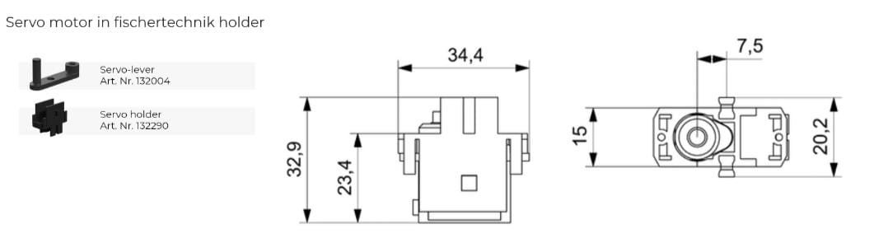
    </td>
  </tr>
</table>

> Motor Codificador o Motor C

Es el motor principal del vehículo. Proporciona la potencia motriz (tracción) para que el coche avance y retroceda. Este motor alimenta las llantas traseras de nuestro vehículo, significando que estas son las que poseen tracción.

<table>
  <tr>
    <td align="center">
      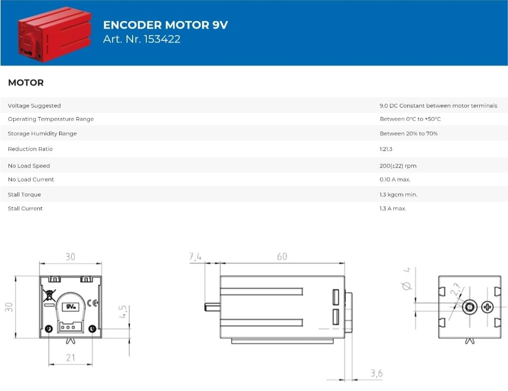
    </td>
    <td>
      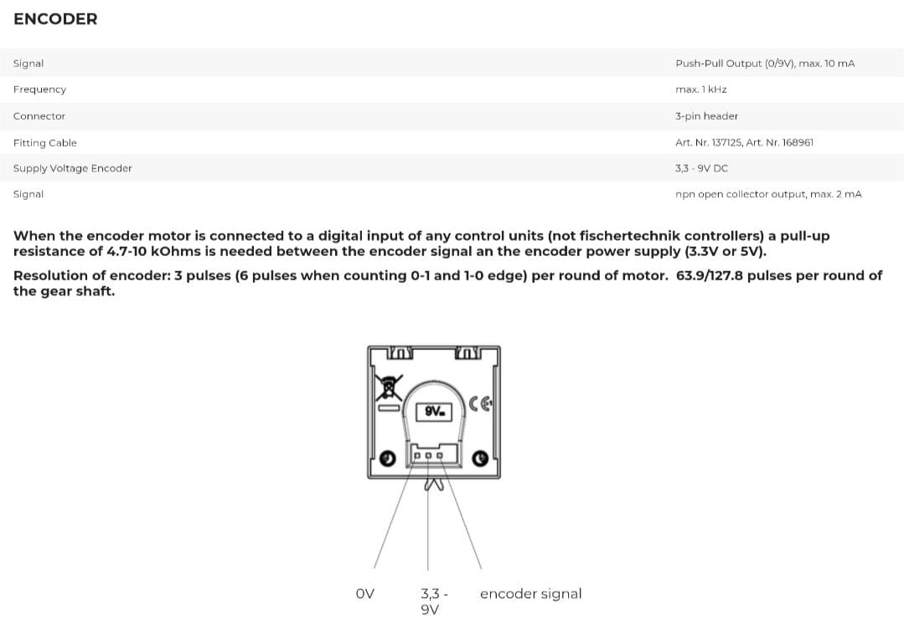
    </td>
    <td>
      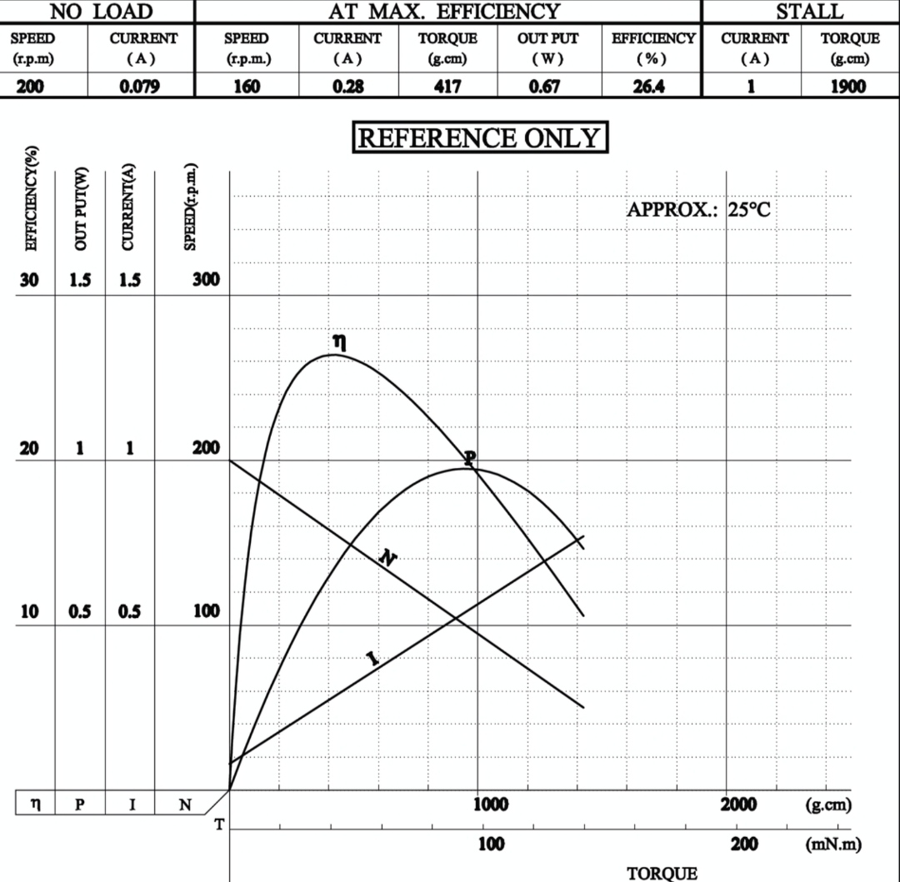
    </td>
  </tr>
</table>

> Engranaje Diferencial

Consiste en una caja de cambios mecánica ubicada entre las dos ruedas motrices, en nuestro caso las ruedas traseras. Permite que las ruedas izquierda y derecha giren a velocidades diferentes mientras reciben potencia del motor. Al girar el coche, la rueda exterior recorre una mayor distancia que la interior. Sin un diferencial, las ruedas se bloquearían, patinarían o derraparían durante las curvas. Este componente garantiza un paso por curva suave y realista, y evita que el coche pierda tracción.

> [!NOTE]
>- Al ser nuestra primera vez participando en una competición WRO, usamos los componentes predeterminados del kit.
>- La tracción trasera se conservó debido a que la mayoría de los carros cotidianos la presentan.
>- En cuanto al engranaje diferencial se pudo observar que ayudó a forzar menos las curvas.

<hr>

- #### Mecanismo Ackermann


Cuando un carro gira, las ruedas delanteras siguen trayectorias con radios diferentes. La rueda interior describe un círculo más cerrado (radio menor), mientras que la exterior describe un arco más amplio (radio mayor). Si ambas ruedas apuntan exactamente en la misma dirección (paralelas entre sí), la rueda interior tiende a arrastrarse o deslizarse lateralmente, ya que se ve forzada a seguir una trayectoria que no le corresponde. Esto genera desgaste prematuro de los neumáticos, mayor esfuerzo de dirección, pérdida de estabilidad y agarre, y mayor radio de giro del vehículo. El mecanismo de Ackermann resuelve este inconveniente haciendo que las ruedas adopten ángulos diferentes automáticamente en el momento cuando las ruedas direccionales giran hacia la izquierda o derecha.

<hr>

- #### Principio Ackermann

El principio de Ackermann se basa en una condición geométrica conocida como la condición de Ackermann. En un giro perfecto, los ejes de todas las ruedas deben intersectarse en un único punto común situado en la prolongación del eje trasero. Este punto es el centro instantáneo de rotación del vehículo. Esto implica que la rueda delantera interior debe girar con un ángulo mayor (αᵢ), mientras que la rueda delantera exterior debe girar con un ángulo menor (αₑ).

La relación entre ambos ángulos viene dada por la fórmula:

```text
cot(αₑ) - cot(αᵢ) = d / L
```

Donde:

d = distancia entre los puntos de pivote de las ruedas (ancho de vía)

L = distancia entre ejes (distancia entre ejes)

Esta relación garantiza que, para cualquier ángulo de giro, el centro de curvatura permanezca sobre la línea del eje trasero, evitando el arrastre lateral de las ruedas.

<hr>

- #### Ackermann en nuestro proyecto

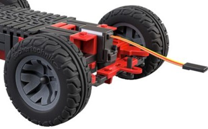

Nuestro coche no cuenta con la presencia de este mecanismo, o también puede ser denominado 0% Ackermann. Esto no afecta mucho al rendimiento, ya que se trata de un vehículo pequeño, pero si lo incluyéramos en el proyecto, nos ayudaría a mejorar los tiempos, por otra parte también se podrían evitar problemas con el desgaste de las llantas. En base a lo investigado, son varias las razones por las que el kit no trae este mecanismo incluido:

1. Es un kit básico de iniciación, pues el Maker Kit Car está diseñado con el propósito de cumplir la función de un chasis base, robusto y fácil de ampliar, no como un modelo a escala de alto rendimiento.

2. Prioridad de funcionalidad educativa: su objetivo principal es servir como plataforma para integrar placas de desarrollo, como Arduino y Raspberry Pi, y aprender sobre robótica y programación, por el hecho de que un sistema de dirección más sencillo, como una mangueta con un servomotor, es más fácil de construir y programar para un individuo no muy conocedor acerca del área.

3. Diferenciación del producto: Fischertechnik reserva el mecanismo Ackermann para sus kits más avanzados, orientados a la competición, como el STEM Coding Competition, que tienen un precio y una complejidad mucho mayores. El Maker Kit Car, con sus 119 piezas, es una opción más accesible y rentable para proyectos creativos.

4. Costo y simplicidad de fabricación: Un mecanismo Ackermann completo requiere más piezas (brazos de dirección angulados, barras de acoplamiento adicionales, geometría precisa) que una simple mangueta con servomotor, lo que aumenta el costo de producción y la complejidad del montaje.

5. Público objetivo: El kit está dirigido a aficionados y creadores que desean experimentar con la electrónica y la programación, no necesariamente a estudiantes de ingeniería que busquen una reproducción exacta de la dinámica de un vehículo.

<hr>

## Manejo de las Fuentes de Energia

- #### UPS LX-2BUPS

<table>
  <tr>
    <td align="center" width="300" >
      
    </td>
    <td>
      <h3>Especificaciones:</h3>
      <ul>
        <li> Tipo de batería: Dos baterías de iones de litio 18650 en paralelo (3,7V) </li>
        <li> Voltaje de salida: Generalmente disponible en versiones de 5V, 9V o 12V </li>
        <li> Corriente máxima de salida: 3A </li>
        <li> Potencia máxima de salida: De 15W a 24W </li>
        <li> Voltaje de entrada: CC estándar de 5 V (a través de Micro USB o USB Tipo-C, según la variante de la placa) </li>
      </ul>
    </td>
  </tr>
</table>

El LX-2BUPS es un popular módulo de alimentación ininterrumpida. Funciona con dos baterías de iones de litio 18650 conectadas en paralelo y proporciona un intercambio instantáneo y sin retardo entre la alimentación de red y la batería de respaldo, lo que lo hace ideal para mantener en funcionamiento dispositivos de bajo consumo en el hogar como routers y módems de internet durante cortes de luz. Utilizamos dos piezas de este componente, uno de 5 V para la Raspberry Pi y otro de 12 V para el driver.

<hr>

- #### Baterías Ultrafire TR 18650

<table>
  <tr>
    <td align="center" width="300" >
      
    </td>
    <td>
      <h3>Especificaciones:</h3>
      <ul>
        <li> Factor de forma: Celda cilíndrica estándar 18650. </li>
        <li> Diámetro: 18 mm. </li>
        <li> Longitud: 65 mm (puede alcanzar hasta 68 mm si incluye un polo positivo tipo botón o un circuito de protección no especificado). </li>
        <li> Química: Iones de litio (Li-ion). </li>
        <li> Tipo de terminal: Polo positivo plano o tipo botón (varía según el distribuidor). </li>
        <li> Voltaje nominal: 3,7 V (Curva estándar de iones de litio: 4,2 V con carga completa, ~2,75 V de corte). </li>
        <li> Capacidad declarada: 9800 mAh. </li>
      </ul>
    </td>
  </tr>
</table>

En el proyecto utilizamos cuatro de estas baterías, dos para cada UPS. Son baterías recargables, las recargamos conectándolas al UPS con un cargador USB-C de 20 W (que admite 9 V / 2,22 A).

<hr>

## Descripción del Software

Este documento presenta el sistema de navegación implementado de un carro autónomo diseñado para la competición **WRO Futuros Ingenieros**, compuesto por los siguientes archivos:

- `src/1st_mode.py` (Desafío sin obstáculos)
- `src/2nd_mode.py` (Ronda con obstáculos)
- `src/Calibration.py` (Script para calibración de colores debido a la variación de iluminación en cada ambiente)
- `src/Ino Code/Arduino_Code.ino` (Script encargado de dar indicaciones a los motores)

> [!IMPORTANT]
>- Los archivos con formato .py fueron implementados en la Raspberry
>- El archivo .ino se encuentra presente en el Arduino

Según las reglas de WRO Futuros Ingenieros 2026, el vehículo participa en un desafío de conducción autónoma en el que debe circular sin supervisión por una pista cuya configuración varía entre rondas. El desafío oficial incluye rondas de Desafío Abierto y rondas de Desafío de Obstáculos, ambas basadas en la navegación autónoma por la pista.

El proyecto se distribuye entre una **Raspberry Pi**, responsable del procesamiento de visión y la toma de decisiones, y un **Arduino**, responsable de ejecutar acciones físicas en el sistema de dirección y tracción.

---

## Objetivo del Software

El objetivo del sistema es permitir que el robot:

- Observe la pista mediante una cámara.
- Detecte visualmente la pista y las paredes.
- Se adapte a una dirección, ya sea en sentido horario o antihorario.
- Complete las vueltas requeridas en la pista de forma autónoma.
- Determine su estado de navegación.
- Genere comandos de velocidad y ángulo de dirección.
- Calibre los umbrales de la cámara antes de las pruebas o competiciones.
- Ejecute los comandos a través del Arduino.

En el sistema implementado, estas tareas se abordan mediante visión artificial, coreografía basada en el tiempo, lógica de decisión basada en estados, herramientas de calibración y comunicación serial entre la Raspberry Pi y el Arduino.

La Raspberry Pi actúa como una computadora, ejecutando los scripts de Python según el modo de desafío seleccionado, mientras que el Arduino funciona como un microcontrolador integrado, ejecutando el código del archivo `src/Ino Code/Arduino_Code.ino`. Intercambian datos de texto mediante comunicación serial utilizando una velocidad sincronizada denominada **baudrate** (velocidad de transmisión).

---

## Arquitectura del Robot

### Distribución Funcional

| Módulo | Archivo | Función principal |
| ------------ | ------------------------------- | -------------------------------------------------------------------------------------------------------- |
| Raspberry Pi | `src/1st_mode.py` | Procesamiento de visión en tiempo real, navegación adaptativa, detección automática de vueltas y control de dirección reactivo |
| Raspberry Pi | `src/2nd_mode.py` | Ejecución de secuencias coreografiadas, comandos de movimiento preprogramados y navegación basada en el tiempo |
| Raspberry Pi | `src/Calibration.py` | Herramienta de calibración de cámara para umbralización de pista y rangos de color HSV |
| Arduino | `src/Ino Code/Arduino_Code.ino` | Recepción de comandos, control de servo, control de motor, lectura de distancia y ejecución física |
| Cámara | Acceso a través de OpenCV | Adquisición de imágenes de pista y procesamiento de fotogramas en tiempo real |

### Flujo del Sistema Físico

```text
Cámara -> Raspberry Pi -> Serial -> Arduino -> Servo / Motor
```

La cámara envía información visual a la Raspberry Pi, esta procesa la imagen y determina el comando de movimiento. El comando se envía mediante comunicación serial al Arduino. El Arduino aplica entonces los valores recibidos al servomotor de dirección y al motor de tracción.

### Conexión de Software a Hardware

El software actual se conecta con los componentes físicos de la siguiente manera:

- **USB Camera -> Raspberry Pi:** `1st_mode.py` y `Calibration.py` abren la cámara con `cv2.VideoCapture(0)` y lee fotogramas en vivo.
- **Raspberry Pi -> Arduino:** Ambos archivos de Python abren el puerto serial `/dev/ttyUSB0` a `115200` baud y envían paquetes de movimientos en formato `<velocidad,ángulo>`.
- **Entrada serie del Arduino -> Raspberry Pi:** Ambos modos de Python están preparados para escuchar el mensaje serie `BTN:1`, que se utiliza como señal de inicio.
- **Arduino -> Servo de dirección:** El ángulo de dirección calculado o seleccionado por el software Python se transmite a través del paquete serie y el Arduino lo aplica físicamente al servo de dirección delantero.
- **Arduino -> Motor de tracción:** El valor de velocidad calculado o seleccionado por el software Python se transmite a través del mismo paquete serie y el Arduino lo aplica físicamente al motor de tracción.
- **Arduino -> Raspberry Pi:** El Arduino también envía telemetría de distancia utilizando el formato `DIST:<distancia>`.

---

## Acerca del Software Implementado

### Script del Modo 1
### Archivo: `src/1er_modo.py`

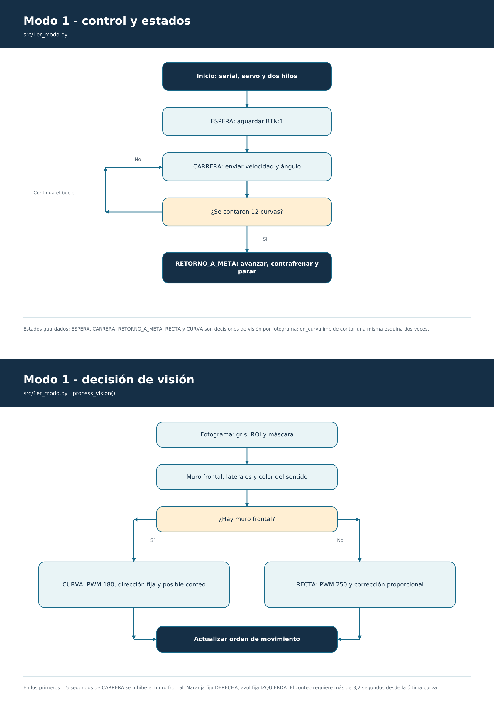

El modo 1 es el modo de navegación autónoma. Utiliza la cámara para analizar la pista en tiempo real, detectar los muros, estimar la dirección de la ruta, controlar el ángulo de dirección y contar las vueltas.

#### Librerías Importadas

```python
import cv2
import numpy as np
import serial
import time
import threading
```

| Biblioteca | Qué es | Por qué se usa en este proyecto |
| ----------- | -------------------------------------------------------------- | ---------------------------------------------------------------------------------------------- |
| `cv2` | Biblioteca OpenCV para visión artificial | Se utiliza para capturar fotogramas de la cámara, convertir imágenes, aplicar desenfoque, umbralización, morfología y visualización |
| `numpy` | Biblioteca de computación numérica para matrices y arreglos | Se utiliza para contar píxeles, crear núcleos, calcular promedios y procesar regiones de la imagen |
| `serial` | Biblioteca de comunicación PySerial | Se utiliza para enviar comandos `<velocidad, ángulo>` a Arduino y leer eventos de botones |
| `time` | Biblioteca de temporización de Python | Se utiliza para controlar retrasos, eliminar rebotes en las esquinas, medir el tiempo de carrera y controlar el ritmo de los bucles |
| `threading` | Biblioteca de Python para ejecución paralela | Se utiliza para ejecutar lectura serial y visión de cámara simultáneamente |

#### Razones por las que estas librerías son necesarias

Este modo requiere que el robot reaccione continuamente mientras se mueve. El procesamiento de la cámara no puede bloquear la comunicación serial, ni esta puede detener el análisis de la imagen. Por ello, se implementa el uso de subprocesos (threading) para que el robot pueda procesar la visión y detectar eventos de los botones simultáneamente.

Se utilizan `cv2` y `numpy` conjuntamente porque OpenCV devuelve las imágenes como matrices numéricas. Cada imagen se trata como una matriz de píxeles, y el código analiza esos píxeles para detectar paredes y tomar decisiones de navegación.

#### Métodos Principales

```python
class WROPrimitivoBlindado:
    def __init__(self):
    def read_serial_data(self):
    def process_vision(self):
    def main_loop(self):
```

#### Responsabilidades Principales

- Establecer comunicación serial con el Arduino.
- Capturar la imagen de la cámara.
- Procesar el área de la pista mediante visión artificial.
- Detectar el muro frontal y los muros laterales.
- Determinar automáticamente la dirección de giro.
- Calcular la velocidad y el ángulo de dirección.
- Contar las curvas y las vueltas completadas.
- Enviar comandos de movimiento al Arduino.

#### Configuración de Parámetros

```python
SERIAL_PORT = "/dev/ttyUSB0"
BAUDRATE = 115200
```

#### Atributos Importantes

```python
self.current_angle = 86
self.current_speed = 0
self.SENTIDO_GIRO = "AUTO"
self.VER_PANTALLAS = True
```

> [!IMPORTANT]
> El ángulo fue establecido en `86` debido a que en `90` las ruedas no quedaban completamente alineadas en el carro.

#### Flujo General del Modo 1

1. El programa intenta establecer la conexión serial con Arduino.
2. Inicializa el estado del robot como `ESPERA`.
3. Inicia un hilo para leer los datos seriales de Arduino.
4. Inicia otro hilo para procesar la imagen de la cámara.
5. Espera la señal del botón `BTN:1`.
6. Al presionar el botón, cambia a `CARRERA`.
7. Durante la carrera, envía continuamente paquetes `<velocidad, ángulo>`.
8. Al completar tres vueltas, cambia a `RETORNO_A_META`.
9. El robot realiza una secuencia de parada final y el programa termina.

---

### Script del Modo 2
### Archivo: `src/2do_modo.py`

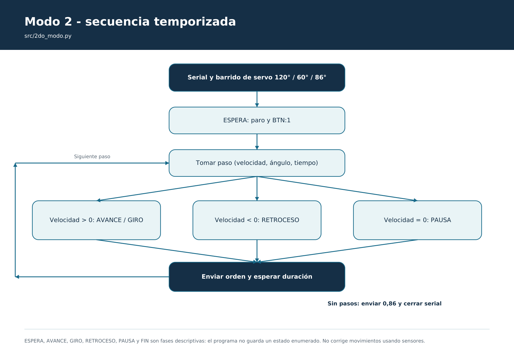

El modo 2 es una secuencia manual basada en coreografía. No utiliza la retroalimentación de la cámara durante la ejecución; en cambio, sigue una lista predefinida de comandos de movimiento donde cada paso contiene velocidad, ángulo de dirección, duración y descripción.

#### Librerías Importadas

```python
import serial
import time
```

| Biblioteca | Qué es | Por qué se usa en este proyecto |
| -------- | --------------------------------------- | ---------------------------------------------------------------------------------- |
| `serial` | Biblioteca de comunicación PySerial | Se utiliza para enviar paquetes temporizados `<velocidad, ángulo>` desde la Raspberry Pi al Arduino |
| `time` | Biblioteca de temporización de Python | Se utiliza para mantener cada movimiento activo durante el número de segundos programado |

#### Razones por las que estas librerías son necesarias

Este modo se basa en la sincronización en lugar de la retroalimentación de la cámara. La biblioteca `time` es necesaria porque cada instrucción de movimiento debe permanecer activa durante un tiempo exacto. La biblioteca `serial` también es necesaria porque cada movimiento debe enviarse al Arduino utilizando el mismo formato de comando que en el Modo 1.

#### Métodos Principales

```python
class WROCoreografia:
    def __init__(self):
    def esperar_boton(self):
    def ejecutar_rutina(self):
    def run(self):
```

#### Responsabilidades Principales

- Abre la comunicación serial con el Arduino.
- Mantiene el robot detenido mientras espera que se pulse el botón de inicio.
- Espera la señal `BTN:1`.
- Ejecuta `RUTINA_MANUAL` paso a paso.
- Envía paquetes `<velocidad, ángulo>` al Arduino.
- Mantener cada comando activo durante el tiempo asignado.
- Detiene el robot al finalizar.

#### Configuración de Parámetros

```python
SERIAL_PORT = "/dev/ttyUSB0"
BAUDRATE = 115200
RUTINA_MANUAL = [
    (velocity, angle, duration, "description"),
]
```

#### Formato de tupla de coreografía

Cada paso del movimiento utiliza esta estructura:

```python
(speed, angle, time_in_seconds, "comment")
```

Por ejemplo:

```python
(250, 86, 0.6, "Aceleración en recta inicial")
```

Esto quiere decir:

- `250`: comando de velocidad del motor.

- `86`: ángulo de dirección, utilizado como posición recta neutral.

- `0.6`: duración en segundos.

- `"Aceleración en recta inicial"`: descripción impresa en la terminal.

#### Secuencia de sincronización del servo

Antes de que comience la rutina principal, el script realiza una sincronización de la dirección:

```python
self.ser.write(b"<0,120>\n")
time.sleep(0.3)
self.ser.write(b"<0,60>\n")
time.sleep(0.3)
self.ser.write(b"<0,86>\n")
```

Esto mueve las ruedas hacia un lado, luego hacia el otro y finalmente las centra. El objetivo es confirmar visualmente que el servo de dirección responde correctamente.

#### Flujo general del Modo 2

1. El programa abre la comunicación serial con Arduino.
2. Espera 2 segundos para que Arduino se reinicie tras abrir la conexión serial.
3. Realiza el protocolo de enlace del servo.
4. Espera la señal de inicio `BTN:1`.
5. Lee la siguiente tupla de `RUTINA_MANUAL`.
6. Convierte la tupla en un comando `<velocidad, ángulo>`.
7. Envía el comando a Arduino.
8. Espera el tiempo definido en la tupla.
9. Continúa hasta que se completen todas las instrucciones.
10. Envía `<0,86>` para detener y centrar el robot.

---

### Script de Arduino
### Archivo: `src/Ino Code/Arduino_code.ino`

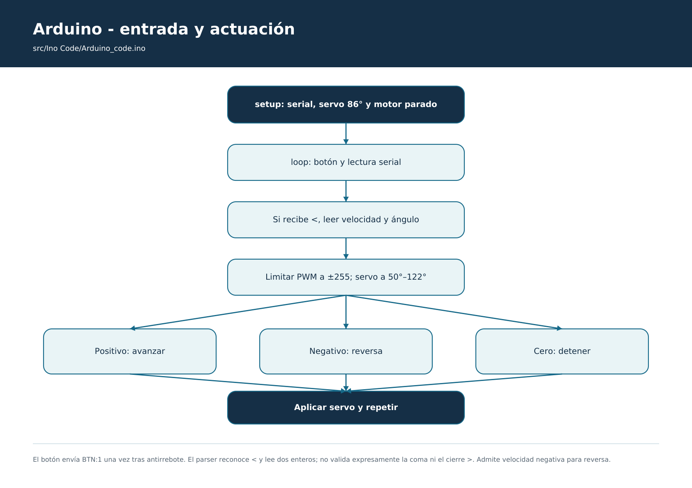

El código de Arduino es la capa de ejecución física del robot. Recibe comandos de la Raspberry Pi, analiza los valores de velocidad y ángulo, aplica el ángulo de dirección al servomotor y controla el motor de tracción.

#### Librerías Importadas

```cpp
#include <Servo.h>
#include <stdlib.h>
```

| Biblioteca | Qué es | Por qué se usa en este proyecto |
| ---------- | ----------------------------------------------- | ------------------------------------------------------------------------------ |
| `Servo.h` | Biblioteca de Arduino para controlar servomotores | Se usa para controlar el servo de dirección conectado al pin `8` |
| `stdlib.h` | Biblioteca estándar de C con funciones de utilidad | Se usa para convertir valores de texto del paquete serie en valores numéricos |

#### Razones por las que estas librerías son necesarias

El Arduino recibe el comando como texto, por ejemplo `<250,86>`. Antes de aplicarlo al motor y al servo, el Arduino debe separar los valores y convertirlos a números. `stdlib.h` se usa para esta conversión. `Servo.h` se usa porque el sistema de dirección depende de un servomotor que recibe instrucciones de ángulo.

#### Conexiones principales del hardware

```cpp
const int PIN_SERVO = 6;
const int PIN_ENA   = 3;
const int PIN_IN1   = 5;
const int PIN_IN2   = 4;
const int PIN_BTN   = 2;
```

| Pin | Componente | Función |
| ---- | ----------------- | ----------------------- |
| `6` | Servo de dirección | Salida de ángulo de dirección |
| `3` | Controlador de motor PWM | Control de velocidad del motor |
| `5` | Controlador de motor IN1 | Línea de dirección del motor 1 |
| `4` | Controlador de motor IN2 | Línea de dirección del motor 2 |
| `2` | Controlador del botón | Pulsador físico de inicio |

#### Responsabilidades principales

- Inicializar la comunicación serial a `115200`.
- Recibir paquetes `<velocidad, ángulo>` de la Raspberry Pi una vez el botón físico se haya pulsado.
- Analizar y validar los valores recibidos.
- Aplicar el ángulo al servomotor de dirección.
- Aplicar la velocidad al motor de tracción.

#### Secuencia de configuración

En `setup()`, el Arduino:

1. Inicia la comunicación serial con `Serial.begin(115200)`.
2. Conecta el servo de dirección.
3. Centra el servo en `86`.
4. Configura los pines del motor como salidas.

#### Protocolo serie recibido por Arduino

Arduino espera paquetes con marcadores de inicio y fin:

```texto
<velocidad,ángulo>
```

Ejemplo:

```texto
<250,86>
```

#### Límites aplicados

Arduino restringe los valores analizados de la siguiente manera:

- La velocidad está limitada a `0..255`.
- El ángulo solo se acepta en el rango `50..122`.

> [!NOTE]
> En la implementación actual de Arduino, los valores de velocidad negativos enviados desde Python están restringidos a `0`. Esto significa que los comandos de reversa requieren soporte de Arduino si se desea un movimiento inverso.

#### Ejecución del movimiento

La función `moverMotor()`:

- Impulsa el motor hacia adelante cuando `vel > 0`,
- Impulsa el motor hacia atrás cuando `vel < 0`,
- Detiene el motor cuando `vel == 0`.

---

### Script de Calibración
### Archivo: `src/calibracion.py`

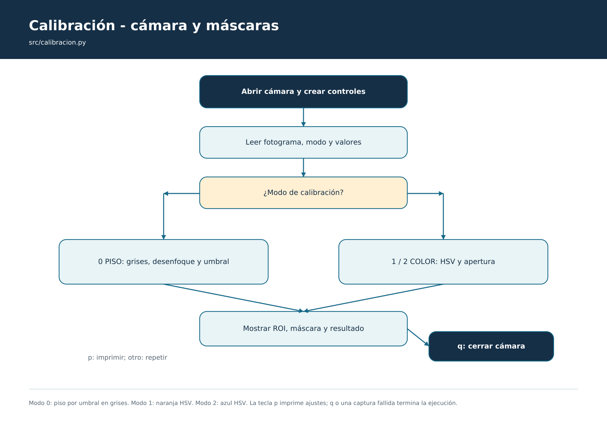

`Calibration.py` es un script de soporte que se utiliza para calibrar los umbrales de la cámara antes de usar el robot en la pista. Ayuda a ajustar los valores utilizados para detectar el suelo.

Este archivo no es el bucle de control autónomo principal. Su propósito es facilitar las pruebas de visión mostrando la región de interés, la máscara generada y el resultado filtrado en tiempo real.

#### Librerías Importadas

```python
import cv2
import numpy as np
```

| Biblioteca | Qué es | Por qué se usa en este proyecto |
| ------- | --------------------------------------------------- | ----------------------------------------------------------------------------------------------- |
| `cv2` | Biblioteca OpenCV para visión artificial | Se utiliza para capturar fotogramas, crear ventanas de control, barras deslizantes, máscaras, umbralización y visualización |
| `numpy` | Biblioteca de computación numérica para matrices y arreglos | Se utiliza para crear arreglos de rango HSV inferior y superior para filtrado de color |

#### Razones por las que estas librerías son necesarias

El calibrador necesita mostrar la salida de la cámara y actualizar los valores de procesamiento de imágenes en tiempo real. `cv2` proporciona las funciones de captura de cámara, ventanas, barras deslizantes, umbralización, conversión HSV, máscaras y visualización. `numpy` proporciona el formato de arreglo necesario para definir los límites inferior y superior de HSV.

#### Funciones principales y proceso

```python
def nada(x):

pass
```

La función `nada()` se utiliza como función de devolución de llamada para las barras de seguimiento de OpenCV. Esta función no necesita ejecutar código, ya que el bucle principal lee continuamente las posiciones de las barras de seguimiento.

#### Barras deslizantes

El script crea controles deslizantes interactivos para:

- `MODO`
- `H Mín`
- `H Máx`
- `S Mín`
- `S Máx`
- `V Mín`
- `V Máx`
- `Umbral Piso`

Estos controles deslizantes permiten al equipo probar valores directamente con la cámara en lugar de modificar el código manualmente cada vez.

#### Calibración de colores

Este script es capaz de calibrar colores, pudiéndose seleccionar el modo; el suelo es el modo 0, las lineas naranjas el 1 y las azules el 2, haciendo lo siguiente:

1. Convierte la ROI a escala de grises.
2. Aplica un desenfoque gaussiano con un kernel de `7x7`.
3. Aplica un umbral binario utilizando el `Umbral Piso` seleccionado.
4. Muestra la máscara como resultado de la detección.

#### Controles del teclado

| Tecla | Acción |
| --- | ------------------------------------------- |
| `p` | Imprime los valores de calibración actuales |
| `q` | Sale del programa de calibración |

#### Flujo general de Calibration.py

1. Abre la cámara.
2. Configura la resolución a `320x240`.
3. Crea la ventana de control.
4. Crea todas las barras deslizantes.
5. Lee un fotograma de la cámara.
6. Lee el modo seleccionado.
7. Si el modo cambió, carga los valores predeterminados para ese modo.
8. Recorta la región de interés (ROI) adecuada.
9. Aplica umbralización de fondo o filtrado de color HSV.
10. Muestra la ROI, la máscara y el resultado filtrado.
11. Imprime los valores si se pulsa la tecla `p`.
12. Termina la ejecución si se pulsa la tecla `q`.

---

## Resumen del Software Implementado

El software actual documentado en este repositorio se centra en dos modos de control en Python, un script de soporte para calibración y una capa de ejecución en Arduino:

- `src/1st_mode.py` para navegación autónoma basada en cámara.
- `src/2nd_mode.py` para coreografía manual basada en tiempo.
- `src/Calibration.py` para calibración de umbral de cámara y HSV.
- `src/Ino Code/Arduino_Code.ino` para recibir comandos y controlar el hardware físico.

Ambos modos de control utilizan la misma ruta de comunicación física desde la Raspberry Pi al Arduino y, desde allí, al hardware de dirección y tracción. El Modo 1 reacciona a la entrada de la cámara en tiempo real, el Modo 2 sigue una rutina temporizada predefinida y el script de calibración ayuda a ajustar los parámetros de visión antes de probar el robot en la pista.


## Puntos a mejorar en nuestro proyecto

Después de esta primera experiencia en una competición WRO y a lo largo de nuestro camino de preparación para estos torneos, nos pudimos dar cuenta de puntos muy clave que se pueden optimizar del carro desarrollado:

1. Chasis del carro: El chasis de nuestro carro nos trajo una serie de dificultades como la limitación del espacio para ubicar los componentes necesarios, desgaste en los dientes del eje diferencial, en las llantas, entre otros aspectos. Para una futura competición, nos gustaría personalizar más nuestro chasis, diseñando e imprimiendo las piezas en 3D que creamos que sean necesarias para el ensamblaje del vehículo. Nos parece de agrado esta idea debido a que consideramos que planificando el diseño y el uso de cada parte del chasis nos evitaríamos una cantidad considerable de inconvenientes que se nos presentaron en esta jornada.

2. Motor codificador más eficiente: Implementando un motor capaz de girar a mayores revoluciones por minuto para alimentar las ruedas con tracción, conseguiríamos mejorar los tiempos para los desafíos, pues el motor codificador usado en esta temporada nos limitó el logro de mejores tiempos. Consideramos que empleando un motor de este tipo pero que acepte mayor voltaje podría solucionar dicho problema.

3. Posible implementación de un Mecanismo Ackermann: En caso de usar un motor codificador capaz de entregarle una mayor cantidad de revoluciones por minuto a las ruedas de nuestro carro, probablemente diseñemos este mecanismo en 3D como parte de nuestro chasis personalizado, esto con el fin de evitar tanto desgaste en las llantas y hacer más estable el vehículo, de tal manera que no resbale o patine, pudiendo influir en su rendimiento sobre la pista.

4. Posición de la cámara: Después de esta primera experiencia en estas competiciones, también en base a lo aprendido analizando el rendimiento de otros equipos, se llegó a la conclusión que una cámara ubicada a mayor altura puede tener la capacidad de un mayor rango de visión del entorno, punto que puede ser aprovechado como una ventaja para el software implementado.

<hr>

## Nuestras experiencias en las regionales

1. Primera Regional (Hotel Maremares - Anzoátegui, Lechería)

Tras observar fallas en la competencia y experimentar las dinámicas de primera mano, se decidió implementar correcciones y modularizar el código para lograr una estrategia más confiable y segura. Uno de los problemas iniciales identificados fue un "punto ciego" al arrancar demasiado cerca de la pared frontal. Debido a que el robot estaba posicionado muy cerca de la pared interior, su campo de visión y la lógica utilizada para determinar la dirección causaban que eligiera consistentemente el camino equivocado, específicamente el opuesto al correcto. Para corregir esto, primero se dividió el código original en dos archivos separados, separando el Modo 1 del Modo 2, lo que resultó en un mejor rendimiento y un flujo de trabajo más manejable. Para solucionar los errores identificados en el Modo 1, se reestructuró el diseño para minimizar la complejidad, simplificando el código lo más posible y asegurando al mismo tiempo la confiabilidad. Se eliminó el controlador PID y sus componentes asociados en favor de una metodología de control Bang-Bang (o encendido/apagado). Esta había demostrado ser más efectiva para nuestro robot durante la competencia; este enfoque nos permitió completar el primer desafío de manera más consistente y con una configuración más fácil de ajustar. Para el Modo 2, se implementó navegación por estima (Dead Reckoning), la cual ofrece una consistencia mucho mayor que la alcanzada en la última competencia. Sin embargo, dado que este método es susceptible a desviaciones o desfases de tiempo, su implementación final se está evaluando antes de la próxima competencia. Se agregaron nuevos comandos al código para el segundo modo con el fin de crear una base de código que luego pueda ser modificada según sea necesario el día de la competencia. 

2. Segunda Regional (Colegio Guayamurí - Nueva Esparta, Porlamar)

Se presentaron problemas de lentitud a la hora de trabajar con la interfaz gráfica de la Raspberry. Se recurrió a trabajar desde la terminal de Powershell de Windows una vez conectado al Hotspot de la Raspberry para compensarlo. Debido a que la Raspberry se sobresaturó de muchos códigos prueba que no se usaron en la competición, el carro redujo considerablemente su rendimiento. Para solucionar el problema de lentitud y rendimiento en carrera, se decidió formatear la Raspberry, no sin antes hacer un respaldo de todos los archivos.

3. Tercera Regional (Hotel Paradise - Anzoátegui, Puerto la Cruz)

Se encontró que el auto presentaba muchas dificultades para determinar cual era el sentido correcto de la pista. Se corrigió añadiendo un algoritmo el cual usaba las líneas de colores presentes en las esquinas de la pista, dando mejores resultados. Se logró visualizar que por el ángulo y el escaso grado de visibilidad que presenta la cámara el sistema no lograba detectar correctamente en ocasiones las líneas en el suelo. Se corrigió la posición de la cámara y se ajusto el ROI y el umbral de láz en la calibración para compensar este ajuste.

<hr>
