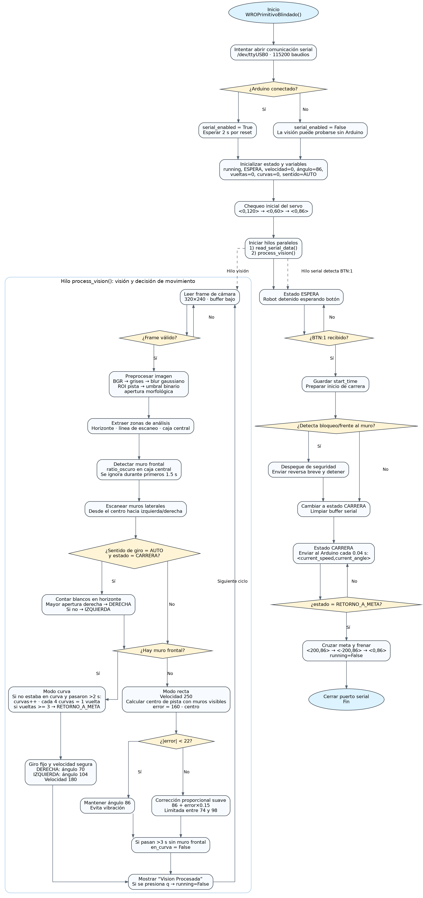
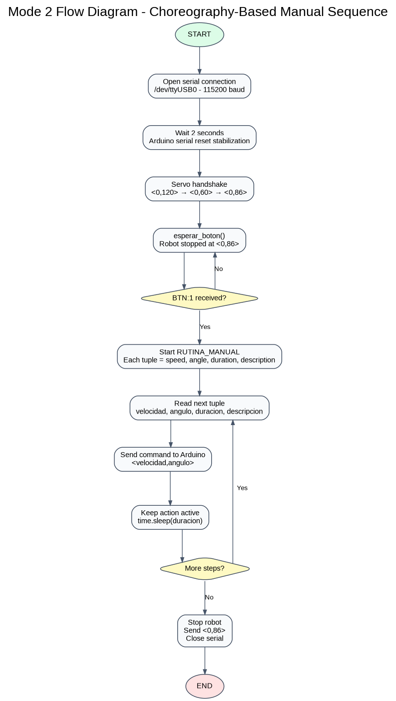
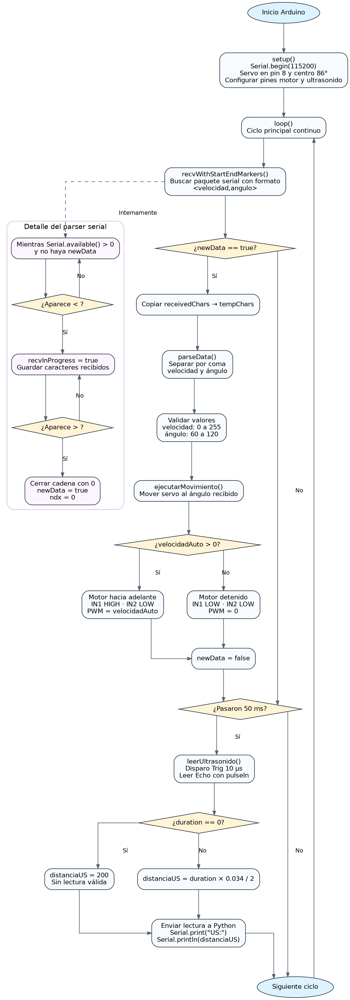
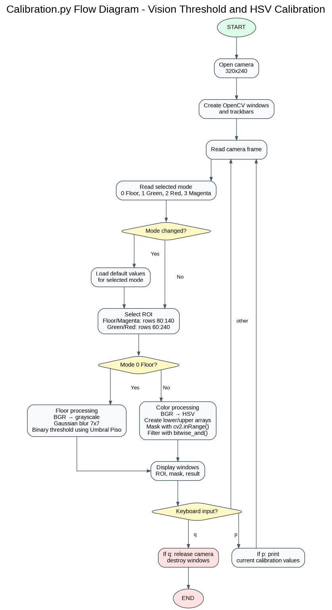

# Documentación Técnica Del Sistema Implementado

## Tabla de Contenido

<!-- toc -->

- [1. Descripción General](#1-descripción-general)
- [2. Objetivo del Sistema](#2-objetivo-del-sistema)
- [3. Arquitectura del Robot](#3-arquitectura-del-robot)
  - [3.1 Distribución Funcional](#31-distribución-funcional)
  - [3.2 Flujo del Sistema Físico](#32-flujo-del-sistema-físico)
  - [3.3 Conexión de Software a Hardware](#33-conexión-de-software-a-hardware)
- [4. Acerca del Software Implementado](#4-acerca-del-software-implementado)
  - [4.1 Script del Modo 1](#41-script-del-modo-1)
  - [4.2 Script del Modo 2](#42-script-del-modo-2)
  - [4.3 Script de Arduino](#43-script-de-arduino)
  - [4.4 Script de Calibración](#44-script-de-calibración)
- [6. Resumen del Software Implementado](#6-resumen-del-software-implementado)

<!-- tocstop -->

---

## 1. Descripción General

Este documento presenta el sistema de navegación implementado de un carro autónomo diseñado para la competición **WRO Futuros Ingenieros**, compuesto por los siguientes archivos:

- `src/1st_mode.py` (Desafío sin obstáculos)
- `src/2nd_mode.py` (Ronda con obstáculos)
- `src/Calibration.py` (Script para calibración de colores debido a la variación de iluminación en cada ambiente)
- `src/Ino Code/Arduino_Code.ino` (Script encargado de dar indicaciones a los motores)

> [!IMPORTANT]
>- Los archivos con formato .py fueron implementados en la Raspberry
>- El archivo .ino se encuentra presente en el Arduino

Según las reglas de WRO Futuros Ingenieros 2026, el vehículo participa en un desafío de conducción autónoma en el que debe circular sin supervisión por una pista cuya configuración varía entre rondas. El desafío oficial incluye rondas de Desafío Abierto y rondas de Desafío de Obstáculos, ambas basadas en la navegación autónoma por la pista.

El proyecto se distribuye entre una **Raspberry Pi**, responsable del procesamiento de visión y la toma de decisiones, y un **Arduino**, responsable de ejecutar acciones físicas en el sistema de dirección y tracción.

---

## 2. Objetivo del Sistema

El objetivo del sistema es permitir que el robot:

- Observe la pista mediante una cámara.
- Detecte visualmente la pista y las paredes.
- Se adapte a una dirección, ya sea en sentido horario o antihorario.
- Complete las vueltas requeridas en la pista de forma autónoma.
- Determine su estado de navegación.
- Genere comandos de velocidad y ángulo de dirección.
- Calibre los umbrales de la cámara antes de las pruebas o competiciones.
- Ejecute los comandos a través del Arduino.

En el sistema implementado, estas tareas se abordan mediante visión artificial, coreografía basada en el tiempo, lógica de decisión basada en estados, herramientas de calibración y comunicación serial entre la Raspberry Pi y el Arduino.

La Raspberry Pi actúa como una computadora, ejecutando los scripts de Python según el modo de desafío seleccionado, mientras que el Arduino funciona como un microcontrolador integrado, ejecutando el código del archivo `src/Ino Code/Arduino_Code.ino`. Intercambian datos de texto mediante comunicación serial utilizando una velocidad sincronizada denominada **baudrate** (velocidad de transmisión).

---

## 3. Arquitectura del Robot

### 3.1 Distribución Funcional

| Módulo | Archivo | Función principal |
| ------------ | ------------------------------- | -------------------------------------------------------------------------------------------------------- |
| Raspberry Pi | `src/1st_mode.py` | Procesamiento de visión en tiempo real, navegación adaptativa, detección automática de vueltas y control de dirección reactivo |
| Raspberry Pi | `src/2nd_mode.py` | Ejecución de secuencias coreografiadas, comandos de movimiento preprogramados y navegación basada en el tiempo |
| Raspberry Pi | `src/Calibration.py` | Herramienta de calibración de cámara para umbralización de pista y rangos de color HSV |
| Arduino | `src/Ino Code/Arduino_Code.ino` | Recepción de comandos, control de servo, control de motor, lectura de distancia y ejecución física |
| Cámara | Acceso a través de OpenCV | Adquisición de imágenes de pista y procesamiento de fotogramas en tiempo real |

### 3.2 Flujo del Sistema Físico

```text
Cámara -> Raspberry Pi -> Serial -> Arduino -> Servo / Motor
```

La cámara envía información visual a la Raspberry Pi, esta procesa la imagen y determina el comando de movimiento. El comando se envía mediante comunicación serial al Arduino. El Arduino aplica entonces los valores recibidos al servomotor de dirección y al motor de tracción.

### 3.3 Conexión de Software a Hardware

El software actual se conecta con los componentes físicos de la siguiente manera:

- **USB Camera -> Raspberry Pi:** `1st_mode.py` y `Calibration.py` abren la cámara con `cv2.VideoCapture(0)` y lee fotogramas en vivo.
- **Raspberry Pi -> Arduino:** Ambos archivos de Python abren el puerto serial `/dev/ttyUSB0` a `115200` baud y envían paquetes de movimientos en formato `<velocidad,ángulo>`.
- **Entrada serie del Arduino -> Raspberry Pi:** Ambos modos de Python están preparados para escuchar el mensaje serie `BTN:1`, que se utiliza como señal de inicio.
- **Arduino -> Servo de dirección:** El ángulo de dirección calculado o seleccionado por el software Python se transmite a través del paquete serie y el Arduino lo aplica físicamente al servo de dirección delantero.
- **Arduino -> Motor de tracción:** El valor de velocidad calculado o seleccionado por el software Python se transmite a través del mismo paquete serie y el Arduino lo aplica físicamente al motor de tracción.
- **Arduino -> Raspberry Pi:** El Arduino también envía telemetría de distancia utilizando el formato `DIST:<distancia>`.

---

## 4. Acerca del Software Implementado

### 4.1 Script del Modo 1
### Archivo: `src/1st_mode.py`



El modo 1 es el modo de navegación autónoma. Utiliza la cámara para analizar la pista en tiempo real, detectar los muros, estimar la dirección de la ruta, controlar el ángulo de dirección y contar las vueltas.

#### Librerías Importadas

```python
import cv2
import numpy as np
import serial
import time
import threading
```

| Biblioteca | Qué es | Por qué se usa en este proyecto |
| ----------- | -------------------------------------------------------------- | ---------------------------------------------------------------------------------------------- |
| `cv2` | Biblioteca OpenCV para visión artificial | Se utiliza para capturar fotogramas de la cámara, convertir imágenes, aplicar desenfoque, umbralización, morfología y visualización |
| `numpy` | Biblioteca de computación numérica para matrices y arreglos | Se utiliza para contar píxeles, crear núcleos, calcular promedios y procesar regiones de la imagen |
| `serial` | Biblioteca de comunicación PySerial | Se utiliza para enviar comandos `<velocidad, ángulo>` a Arduino y leer eventos de botones |
| `time` | Biblioteca de temporización de Python | Se utiliza para controlar retrasos, eliminar rebotes en las esquinas, medir el tiempo de carrera y controlar el ritmo de los bucles |
| `threading` | Biblioteca de Python para ejecución paralela | Se utiliza para ejecutar lectura serial y visión de cámara simultáneamente |

#### Razones por las que estas librerías son necesarias

Este modo requiere que el robot reaccione continuamente mientras se mueve. El procesamiento de la cámara no puede bloquear la comunicación serial, ni esta puede detener el análisis de la imagen. Por ello, se implementa el uso de subprocesos (threading) para que el robot pueda procesar la visión y detectar eventos de los botones simultáneamente.

Se utilizan `cv2` y `numpy` conjuntamente porque OpenCV devuelve las imágenes como matrices numéricas. Cada imagen se trata como una matriz de píxeles, y el código analiza esos píxeles para detectar paredes y tomar decisiones de navegación.

#### Métodos Principales

```python
class WROPrimitivoBlindado:
    def __init__(self):
    def read_serial_data(self):
    def process_vision(self):
    def main_loop(self):
```

#### Responsabilidades Principales

- Establecer comunicación serial con el Arduino.
- Capturar la imagen de la cámara.
- Procesar el área de la pista mediante visión artificial.
- Detectar el muro frontal y los muros laterales.
- Determinar automáticamente la dirección de giro.
- Calcular la velocidad y el ángulo de dirección.
- Contar las curvas y las vueltas completadas.
- Enviar comandos de movimiento al Arduino.

#### Configuración de Parámetros

```python
SERIAL_PORT = "/dev/ttyUSB0"
BAUDRATE = 115200
```

#### Atributos Importantes

```python
self.current_angle = 86
self.current_speed = 0
self.SENTIDO_GIRO = "AUTO"
self.VER_PANTALLAS = True
```

> [!IMPORTANT]
> El ángulo fue establecido en `86` debido a que en `90` las ruedas no quedaban completamente alineadas en el carro.

#### Flujo General del Modo 1

1. El programa intenta establecer la conexión serial con Arduino.
2. Inicializa el estado del robot como `ESPERA`.
3. Inicia un hilo para leer los datos seriales de Arduino.
4. Inicia otro hilo para procesar la imagen de la cámara.
5. Espera la señal del botón `BTN:1`.
6. Al presionar el botón, cambia a `CARRERA`.
7. Durante la carrera, envía continuamente paquetes `<velocidad, ángulo>`.
8. Al completar tres vueltas, cambia a `RETORNO_A_META`.
9. El robot realiza una secuencia de parada final y el programa termina.

---

### 4.2 Script del Modo 2
### Archivo: `src/2nd_mode.py`



El modo 2 es una secuencia manual basada en coreografía. No utiliza la retroalimentación de la cámara durante la ejecución; en cambio, sigue una lista predefinida de comandos de movimiento donde cada paso contiene velocidad, ángulo de dirección, duración y descripción.

#### Librerías Importadas

```python
import serial
import time
```

| Biblioteca | Qué es | Por qué se usa en este proyecto |
| -------- | --------------------------------------- | ---------------------------------------------------------------------------------- |
| `serial` | Biblioteca de comunicación PySerial | Se utiliza para enviar paquetes temporizados `<velocidad, ángulo>` desde la Raspberry Pi al Arduino |
| `time` | Biblioteca de temporización de Python | Se utiliza para mantener cada movimiento activo durante el número de segundos programado |

#### Razones por las que estas librerías son necesarias

Este modo se basa en la sincronización en lugar de la retroalimentación de la cámara. La biblioteca `time` es necesaria porque cada instrucción de movimiento debe permanecer activa durante un tiempo exacto. La biblioteca `serial` también es necesaria porque cada movimiento debe enviarse al Arduino utilizando el mismo formato de comando que en el Modo 1.

#### Métodos Principales

```python
class WROCoreografia:
    def __init__(self):
    def esperar_boton(self):
    def ejecutar_rutina(self):
    def run(self):
```

#### Responsabilidades Principales

- Abre la comunicación serial con el Arduino.
- Mantiene el robot detenido mientras espera que se pulse el botón de inicio.
- Espera la señal `BTN:1`.
- Ejecuta `RUTINA_MANUAL` paso a paso.
- Envía paquetes `<velocidad, ángulo>` al Arduino.
- Mantener cada comando activo durante el tiempo asignado.
- Detiene el robot al finalizar.

#### Configuración de Parámetros

```python
SERIAL_PORT = "/dev/ttyUSB0"
BAUDRATE = 115200
RUTINA_MANUAL = [
    (velocity, angle, duration, "description"),
]
```

#### Formato de tupla de coreografía

Cada paso del movimiento utiliza esta estructura:

```python
(speed, angle, time_in_seconds, "comment")
```

Por ejemplo:

```python
(250, 86, 0.6, "Aceleración en recta inicial")
```

Esto quiere decir:

- `250`: comando de velocidad del motor.

- `86`: ángulo de dirección, utilizado como posición recta neutral.

- `0.6`: duración en segundos.

- `"Aceleración en recta inicial"`: descripción impresa en la terminal.

#### Secuencia de sincronización del servo

Antes de que comience la rutina principal, el script realiza una sincronización de la dirección:

```python
self.ser.write(b"<0,120>\n")
time.sleep(0.3)
self.ser.write(b"<0,60>\n")
time.sleep(0.3)
self.ser.write(b"<0,86>\n")
```

Esto mueve las ruedas hacia un lado, luego hacia el otro y finalmente las centra. El objetivo es confirmar visualmente que el servo de dirección responde correctamente.

#### Flujo general del Modo 2

1. El programa abre la comunicación serial con Arduino.
2. Espera 2 segundos para que Arduino se reinicie tras abrir la conexión serial.
3. Realiza el protocolo de enlace del servo.
4. Espera la señal de inicio `BTN:1`.
5. Lee la siguiente tupla de `RUTINA_MANUAL`.
6. Convierte la tupla en un comando `<velocidad, ángulo>`.
7. Envía el comando a Arduino.
8. Espera el tiempo definido en la tupla.
9. Continúa hasta que se completen todas las instrucciones.
10. Envía `<0,86>` para detener y centrar el robot.

---

### 4.3 Script de Arduino
### Archivo: `src/Ino Code/Arduino_Code.ino`



El código de Arduino es la capa de ejecución física del robot. Recibe comandos de la Raspberry Pi, analiza los valores de velocidad y ángulo, aplica el ángulo de dirección al servomotor y controla el motor de tracción.

#### Librerías Importadas

```cpp
#include <Servo.h>
#include <stdlib.h>
```

| Biblioteca | Qué es | Por qué se usa en este proyecto |
| ---------- | ----------------------------------------------- | ------------------------------------------------------------------------------ |
| `Servo.h` | Biblioteca de Arduino para controlar servomotores | Se usa para controlar el servo de dirección conectado al pin `8` |
| `stdlib.h` | Biblioteca estándar de C con funciones de utilidad | Se usa para convertir valores de texto del paquete serie en valores numéricos |

#### Razones por las que estas librerías son necesarias

El Arduino recibe el comando como texto, por ejemplo `<250,86>`. Antes de aplicarlo al motor y al servo, el Arduino debe separar los valores y convertirlos a números. `stdlib.h` se usa para esta conversión. `Servo.h` se usa porque el sistema de dirección depende de un servomotor que recibe instrucciones de ángulo.

#### Conexiones principales del hardware

```cpp
const int pinServo = 8;
const int pinMotorPWM = 7;
const int pinMotorDir1 = 9;
const int pinMotorDir2 = 10;
```

| Pin | Componente | Función |
| ---- | ----------------- | ----------------------- |
| `8` | Servo de dirección | Salida de ángulo de dirección |
| `7` | Controlador de motor PWM | Control de velocidad del motor |
| `9` | Controlador de motor IN1 | Línea de dirección del motor 1 |
| `10` | Controlador de motor IN2 | Línea de dirección del motor 2 |

#### Responsabilidades principales

- Inicializar la comunicación serial a `115200`.
- Recibir paquetes `<velocidad, ángulo>` de la Raspberry Pi.
- Analizar y validar los valores recibidos.
- Aplicar el ángulo al servomotor de dirección.
- Aplicar la velocidad al motor de tracción.

#### Variables Principales

```cpp
int velocidadAuto = 0;
int anguloServo = 86;
unsigned long previousMillisSensor = 0;
```

Estas variables almacenan:

- La velocidad actual del motor,
- El ángulo de dirección actual,

#### Secuencia de configuración

En `setup()`, el Arduino:

1. Inicia la comunicación serial con `Serial.begin(115200)`.
2. Conecta el servo de dirección.
3. Centra el servo en `86`.
4. Configura los pines del motor como salidas.

#### Protocolo serie recibido por Arduino

Arduino espera paquetes con marcadores de inicio y fin:

```texto
<velocidad,ángulo>
```

Ejemplo:

```texto
<250,86>
```

La función `recvWithStartEndMarkers()` lee el paquete entre `<` y `>`. La función `parseData()` separa los valores con comas y los convierte en:

- `velocidadAuto`
- `ánguloServo`

#### Límites aplicados

Arduino restringe los valores analizados de la siguiente manera:

- La velocidad está limitada a `0..255`.
- El ángulo solo se acepta en el rango `60..120`.

> [!NOTE]
> En la implementación actual de Arduino, los valores de velocidad negativos enviados desde Python están restringidos a `0`. Esto significa que los comandos de reversa requieren soporte de Arduino si se desea un movimiento inverso.

#### Ejecución del movimiento

La función `ejecutarMovimiento()`:

- Escribe `ánguloServo` en el servo de dirección,
- Impulsa el motor hacia adelante cuando `velocidadAuto > 0`,
- Detiene el motor cuando `velocidadAuto == 0`.

---

### 4.4 Script de Calibración
### Archivo: `src/Calibration.py`



`Calibration.py` es un script de soporte que se utiliza para calibrar los umbrales de la cámara antes de usar el robot en la pista. Ayuda a ajustar los valores utilizados para detectar el suelo.

Este archivo no es el bucle de control autónomo principal. Su propósito es facilitar las pruebas de visión mostrando la región de interés, la máscara generada y el resultado filtrado en tiempo real.

#### Librerías Importadas

```python
import cv2
import numpy as np
```

| Biblioteca | Qué es | Por qué se usa en este proyecto |
| ------- | --------------------------------------------------- | ----------------------------------------------------------------------------------------------- |
| `cv2` | Biblioteca OpenCV para visión artificial | Se utiliza para capturar fotogramas, crear ventanas de control, barras deslizantes, máscaras, umbralización y visualización |
| `numpy` | Biblioteca de computación numérica para matrices y arreglos | Se utiliza para crear arreglos de rango HSV inferior y superior para filtrado de color |

#### Razones por las que estas librerías son necesarias

El calibrador necesita mostrar la salida de la cámara y actualizar los valores de procesamiento de imágenes en tiempo real. `cv2` proporciona las funciones de captura de cámara, ventanas, barras deslizantes, umbralización, conversión HSV, máscaras y visualización. `numpy` proporciona el formato de arreglo necesario para definir los límites inferior y superior de HSV.

#### Funciones principales y proceso

```python
def nada(x):

pass
```

La función `nada()` se utiliza como función de devolución de llamada para las barras de seguimiento de OpenCV. Esta función no necesita ejecutar código, ya que el bucle principal lee continuamente las posiciones de las barras de seguimiento.

#### Barras deslizantes

El script crea controles deslizantes interactivos para:

- `MODO`
- `H Mín`
- `H Máx`
- `S Mín`
- `S Máx`
- `V Mín`
- `V Máx`
- `Umbral Piso`

Estos controles deslizantes permiten al equipo probar valores directamente con la cámara en lugar de modificar el código manualmente cada vez.

#### Calibración del suelo

Para la calibración del suelo, el script hace lo siguiente:

1. Convierte la ROI a escala de grises.
2. Aplica un desenfoque gaussiano con un kernel de `7x7`.
3. Aplica un umbral binario utilizando el `Umbral Piso` seleccionado.
4. Muestra la máscara como resultado de la detección.

#### Controles del teclado

| Tecla | Acción |
| --- | ------------------------------------------- |
| `p` | Imprime los valores de calibración actuales |
| `q` | Sale del programa de calibración |

#### Flujo general de Calibration.py

1. Abre la cámara.
2. Configura la resolución a `320x240`.
3. Crea la ventana de control.
4. Crea todas las barras deslizantes.
5. Lee un fotograma de la cámara.
6. Lee el modo seleccionado.
7. Si el modo cambió, carga los valores predeterminados para ese modo.
8. Recorta la región de interés (ROI) adecuada.
9. Aplica umbralización de fondo o filtrado de color HSV.
10. Muestra la ROI, la máscara y el resultado filtrado.
11. Imprime los valores si se pulsa la tecla `p`.
12. Termina la ejecución si se pulsa la tecla `q`.

---

## 6. Resumen del Software Implementado

El software actual documentado en este repositorio se centra en dos modos de control en Python, un script de soporte para calibración y una capa de ejecución en Arduino:

- `src/1st_mode.py` para navegación autónoma basada en cámara.
- `src/2nd_mode.py` para coreografía manual basada en tiempo.
- `src/Calibration.py` para calibración de umbral de cámara y HSV.
- `src/Ino Code/Arduino_Code.ino` para recibir comandos y controlar el hardware físico.

Ambos modos de control utilizan la misma ruta de comunicación física desde la Raspberry Pi al Arduino y, desde allí, al hardware de dirección y tracción. El Modo 1 reacciona a la entrada de la cámara en tiempo real, el Modo 2 sigue una rutina temporizada predefinida y el script de calibración ayuda a ajustar los parámetros de visión antes de probar el robot en la pista.
